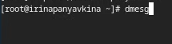

---
## Front matter
lang: ru-RU
title: Лабораторная работа №1
subtitle: Операционные системы
author:
  - Панявкина И.В.
institute:
  - Российский университет дружбы народов, Москва, Россия
date: 08 марта 2025

## i18n babel
babel-lang: russian
babel-otherlangs: english

## Formatting pdf
toc: false
toc-title: Содержание
slide_level: 2
aspectratio: 169
section-titles: true
theme: metropolis
header-includes:
 - \metroset{progressbar=frametitle,sectionpage=progressbar,numbering=fraction}
---

## Цель работы

Целью данной работы является приобретение практических навыков установки операционной системы на виртуальную машину, настройки минимально необходимых для дальнейшей работы сервисов.

## Задание

1.  Создание виртуальной машины
2.  Установка операционной системы
3.  Работа с операционной системой после установки
4.  Установка программного обеспечения для создания документации
5.  Дополнительные задания

## Выполнение лабораторной работы. Создание виртуальной машины
  Virtualbox я устанавливала и настраивала при выполнении лабораторной работы в курсе “Архитектура компьютера и Операционные системы (раздел”Архитектура компьютера”)“, поэтому сразу открываю окно приложения (рис.1).
 
{#fig:001 width=70%} 

## Выполнение лабораторной работы. Создание виртуальной машины
  Нажимая “создать”, создаю новую виртуальную машину, указываю ее имя, путь к папке машины по умолчанию меня устраивает, выбираю тип ОС и версию, указываю путь к файлу iso (рис.2).

{#fig:002 width=70%}

## Выполнение лабораторной работы. Создание виртуальной машины
  Указываю объем основной памяти виртуальной машины размером 6144МБ (рис.3).

{#fig:003 width=70%}

## Выполнение лабораторной работы. Создание виртуальной машины
  Выбираю создание нового виртуального жесткого диска, в опции выбираю VDI диск. Задаю 100ГБ памяти. Делаю его динамическим (рис.4).

{#fig:004 width=70%}

## Выполнение лабораторной работы. Создание виртуальной машины
  Выбираю в Virtualbox настройку своей виртуальной машины. Перехожу в “Носители” и проверяю наличие файла скачанный образ операционной системы Fedora (рис.5).

{#fig:005 width=70%}

## Выполнение лабораторной работы. Установка операционной системы

  Затем запускаю виртуальную машину для установки (рис.6).

{#fig:006 width=70%}

## Выполнение лабораторной работы. Установка операционной системы
  Загрузился интерфейс (рис.7).
  
{#fig:007 width=70%}
  
## Выполнение лабораторной работы. Установка операционной системы
  Нажимаю Win+D для запуска лаунчера. В нем выбираю команду install to hard drive (аналогично liveinst) и нажимаю enter (рис.8).

{#fig:008 width=70%}

## Выполнение лабораторной работы. Установка операционной системы
  Открывается программа для установки. Выбираю язык для использования в процессе установки - русский (рис.9).

{#fig:009 width=70%}

## Выполнение лабораторной работы. Установка операционной системы
  Далее появляется "Обзор установки" с различными параметрами для настройки (рис.10).
  
{#fig:010 width=70%}

## Выполнение лабораторной работы. Установка операционной системы
  Проверяю место установки и сохраняю значение по умолчанию (рис.11).

{#fig:011 width=70%}

## Выполнение лабораторной работы. Установка операционной системы
  Задаю сеть и имя узла (рис.12).

{#fig:012 width=70%}

## Выполнение лабораторной работы. Установка операционной системы
  Настраиваю аккаунт администратора. Включаю учетную запись root, создаю пароль для супер-пользователя (рис.13).

{#fig:013 width=70%}

## Выполнение лабораторной работы. Установка операционной системы
  Далее создаю пользователя, добавляю административные привилегии для этой учетной записи, чтобы я могла свободно выполнять команды как супер-пользователь (рис.14).

{#fig:014 width=70%}

## Выполнение лабораторной работы. Установка операционной системы
  Затем дожидаюсь окончания процесса установки. После установки нажимаю “завершить установку”. Диск не отключался автоматически, поэтому я отключила носитель информации с образом. (рис.15).

{#fig:015 width=70%}
 
## Выполнение лабораторной работы. Работа с операционной системой после установки
  Запускаю виртуальную машину. Вхожу в ОС под заданной мной при установке учетной записью (рис.16).

{#fig:016 width=70%}

## Выполнение лабораторной работы. Работа с операционной системой после установки
  Затем открываю терминал с помощью win+enter и переключаюсь на супер-пользователя  (рис.17).

{#fig:017 width=70%}

## Выполнение лабораторной работы. Работа с операционной системой после установки
  Обновляю все пакеты (рис.18).
  
{#fig:018 width=70%}

## Выполнение лабораторной работы. Работа с операционной системой после установки
  Устанавливаю средства разработки (рис.19).
 
{#fig:019 width=70%}

## Выполнение лабораторной работы. Работа с операционной системой после установки
  Устанавливаю программы для удобства работы в концсоли: tmux для открытия нескольких “вкладок” в одном терминале, mc в качестве файлового менеджера в терминале (рис.20).
 
{#fig:020 width=70%}

## Выполнение лабораторной работы. Работа с операционной системой после установки
  Устанавливаю программы для автоматического обновления (рис.21).
 
{#fig:021 width=70%}
 
## Выполнение лабораторной работы. Работа с операционной системой после установки
  Запускаю таймер (рис.22).
 
{#fig:022 width=70%}

## Выполнение лабораторной работы. Работа с операционной системой после установки
  - Перемещаюсь в директорию /etc/selinux,
  - открываю nano,
  - ищу нужный файл и открываю его (рис.23).
 
{#fig:023 width=70%}

## Выполнение лабораторной работы. Работа с операционной системой после установки
  Изменяю открытый файл: SELINUX=enforcing меняю на значение SELINUX=permissive (рис.24).
 
{#fig:024 width=70%}

## Выполнение лабораторной работы. Работа с операционной системой после установки
  Перезагружаю виртуальную машину (рис.25).
 
{#fig:025 width=70%}

## Выполнение лабораторной работы. Работа с операционной системой после установки
  - Снова вхожу в ОС,
  - запускаю терминал,
  - запускаю терминальный мультиплексор (рис.26).
 
{#fig:026 width=70%}

## Выполнение лабораторной работы. Работа с операционной системой после установки
  Переключаюсь на роль супер-пользователя и устанавливаю пакет dkms (рис.27).
 
{#fig:027 width=70%}

## Выполнение лабораторной работы. Работа с операционной системой после установки
  - В меню виртуальной машины подключаю образ диска гостевой ОС 
  - примонтирую диск с помощью утилиты mount (рис.28).
 
{#fig:028 width=70%}

## Выполнение лабораторной работы. Работа с операционной системой после установки
  Устанавливаю драйвера (рис.29).
 
{#fig:029 width=70%}

## Выполнение лабораторной работы. Работа с операционной системой после установки
  Перезагружаю виртуальную машину (рис.30).
 
{#fig:030 width=70%}

## Выполнение лабораторной работы. Работа с операционной системой после установки
  - Перехожу в директорию /tc/X11/xorg.conf.d,
  - открываю mc для удобства,
  - открываю файл 00-keyboard.conf (рис.31).
 
{#fig:031 width=70%}

## Выполнение лабораторной работы. Работа с операционной системой после установки
  Редактирую конфигурационный файл (рис.32).
 
{#fig:032 width=70%}

## Выполнение лабораторной работы. Работа с операционной системой после установки
  Перезагружаю виртуальную машину (рис.33).
 
{#fig:033 width=70%}

## Выполнение лабораторной работы. Установка программного обеспечения для создания документации

  - Запускаю терминал и терминальный мультиплексор tmux, переключаюсь на роль супер-пользователя. 
  - Устанавливаю pandoc с помощью утилиты dnf и флага -y, который автоматически на все вопросы системы отвечает “yes” (рис.34)

{#fig:034 width=70%}

## Выполнение лабораторной работы. Установка программного обеспечения для создания документации
  Устанавливаю необходимые расширения для pandoc (рис.35)
  
{#fig:035 width=70%}

## Выполнение лабораторной работы. Установка программного обеспечения для создания документации
  Устанавливаю дистрибутив texlive (рис.36)
 
{#fig:036 width=70%}

## Выводы

При выполнении данной лабораторной работы, я приобрела практические навыки установки операционной системы на виртуальную машину, а также сделала настройки минимально необходимых для дальнейшей работы сервисов.

## Выполнение дополнительного задания
  Ввожу в терминале команду dmesg, чтобы проанализировать последовательность загрузки системы (рис.37).

{#fig:037 width=70%}

## Выполнение дополнительного задания
  С помощью поиска, осуществляемого командой ‘dmesg | grep -i ’, ищу версию ядра Linux: 6.13.5-200.fc41.x86_64 (рис.38).
 
{#fig:038 width=70%}

## Выполнение дополнительного задания
  К сожалению, если вводить “Detected Mhz processor” там, где нужно указывать, что я ищу, то мне ничего не выведется. Это происходит потому, что запрос не предусматривает дополнительные символы внутри него (я проверяла, будет ли работать он с маской - не будет). В таком случае я оставила одно из ключевых слов (могла оставить два: “Mhz processor”) и получила результат: 2496.01 Mhz (рис.39).
 
{#fig:039 width=70%}

## Выполнение дополнительного задания
  Аналогично ищу модель процессора (рис.40).
 
{#fig:040 width=70%}

## Выполнение дополнительного задания
  Объем доступной оперативной памяти ищу аналогично поиску частоты процессора, т. к. возникла та же проблема, что и там (рис.41).
 
{#fig:041 width=70%}

## Выполнение дополнительного задания
  Нахожу тип обнаруженного гипервизора (рис.42).

{#fig:042 width=70%}

## Выполнение дополнительного задания
  Тип файловой системы корневого раздела можно посомтреть с помощью утилиты fdisk (рис.43).

{#fig:043 width=70%}

## Выполнение дополнительного задания
  Последовательность монтирования файловых систем можно посмотреть, введя в поиск по результату dmesg слово mount (рис.44).

{#fig:044 width=70%}

# Список литературы{.unnumbered}

1.  Dash P. Getting started with oracle vm virtualbox. Packt Publishing Ltd, 2013. 86 p.
2.  Colvin H. Virtualbox: An ultimate guide book on virtualization with virtualbox. CreateSpace Independent Publishing Platform, 2015. 70 p.
3.  van Vugt S. Red hat rhcsa/rhce 7 cert guide : Red hat enterprise linux 7 (ex200 and ex300). Pearson IT Certification, 2016. 1008 p.
4.  Робачевский А., Немнюгин С., Стесик О. Операционная система unix. 2-е изд. Санкт-Петербург: БХВ-Петербург, 2010. 656 p.
5.  Немет Э. et al. Unix и Linux: руководство системного администратора. 4-е изд. Вильямс, 2014. 1312 p.
6.  Колисниченко Д.Н. Самоучитель системного администратора Linux. СПб.: БХВ-Петербург, 2011. 544 p.
7.  Robbins A. Bash pocket reference. O’Reilly Media, 2016. 156 p.

