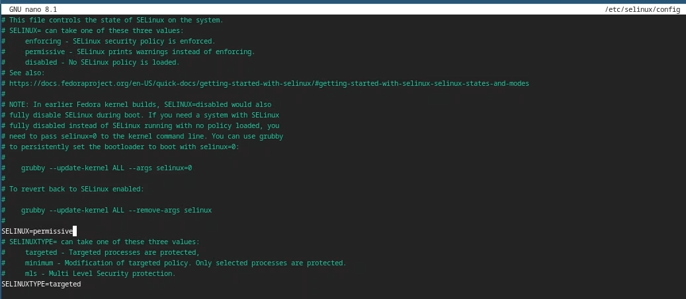

---
## Front matter
title: "Отчет по лабораторной работе №1"
subtitle: "Операционные системы"
author: "Ирина Васильевна Панявкина"

## Generic otions
lang: ru-RU
toc-title: "Содержание"

## Bibliography
bibliography: bib/cite.bib
csl: pandoc/csl/gost-r-7-0-5-2008-numeric.csl

## Pdf output format
toc: true # Table of contents
toc-depth: 2
lof: true # List of figures
lot: true # List of tables
fontsize: 12pt
linestretch: 1.5
papersize: a4
documentclass: scrreprt
## I18n polyglossia
polyglossia-lang:
  name: russian
  options:
	- spelling=modern
	- babelshorthands=true
polyglossia-otherlangs:
  name: english
## I18n babel
babel-lang: russian
babel-otherlangs: english
## Fonts
mainfont: IBM Plex Serif
romanfont: IBM Plex Serif
sansfont: IBM Plex Sans
monofont: IBM Plex Mono
mathfont: STIX Two Math
mainfontoptions: Ligatures=Common,Ligatures=TeX,Scale=0.94
romanfontoptions: Ligatures=Common,Ligatures=TeX,Scale=0.94
sansfontoptions: Ligatures=Common,Ligatures=TeX,Scale=MatchLowercase,Scale=0.94
monofontoptions: Scale=MatchLowercase,Scale=0.94,FakeStretch=0.9
mathfontoptions:
## Biblatex
biblatex: true
biblio-style: "gost-numeric"
biblatexoptions:
  - parentracker=true
  - backend=biber
  - hyperref=auto
  - language=auto
  - autolang=other*
  - citestyle=gost-numeric
## Pandoc-crossref LaTeX customization
figureTitle: "Рис."
tableTitle: "Таблица"
listingTitle: "Листинг"
lofTitle: "Список иллюстраций"
lotTitle: "Список таблиц"
lolTitle: "Листинги"
## Misc options
indent: true
header-includes:
  - \usepackage{indentfirst}
  - \usepackage{float} # keep figures where there are in the text
  - \floatplacement{figure}{H} # keep figures where there are in the text
---

# Цель работы

Целью данной работы является приобретение практических навыков установки операционной системы на виртуальную машину, настройки минимально необходимых для дальнейшей работы сервисов.

# Задание

1.  Создание виртуальной машины
2.  Установка операционной системы
3.  Работа с операционной системой после установки
4.  Установка программного обеспечения для создания документации
5.  Дополнительные задания

# Выполнение лабораторной работы

## Создание виртуальной машины

  Virtualbox я устанавливала и настраивала при выполнении лабораторной работы в курсе “Архитектура компьютера и Операционные системы (раздел”Архитектура компьютера”)“, поэтому сразу открываю окно приложения (рис. [-@fig:001]).
 
{#fig:001 width=70%} 

  Нажимая “создать”, создаю новую виртуальную машину, указываю ее имя, путь к папке машины по умолчанию меня устраивает, выбираю тип ОС и версию, указываю путь к файлу iso (рис. [-@fig:002]).

{#fig:002 width=70%}

  Указываю объем основной памяти виртуальной машины размером 6144МБ (рис. [-@fig:003]).

{#fig:003 width=70%}

  Выбираю создание нового виртуального жесткого диска, в опции выбираю VDI диск. Задаю 100ГБ памяти. Делаю его динамическим (рис. [-@fig:004]).

{#fig:004 width=70%}

  Выбираю в Virtualbox настройку своей виртуальной машины. Перехожу в “Носители” и проверяю наличие файла скачанный образ операционной системы Fedora (рис. [-@fig:005]).

{#fig:005 width=70%}

## Установка операционной системы

  Затем запускаю виртуальную машину для установки (рис. [-@fig:006]).

{#fig:006 width=70%}

  Загрузился интерфейс (рис. [-@fig:007]).
  
{#fig:007 width=70%}
  
  Нажимаю Win+D для запуска лаунчера. В нем выбираю команду install to hard drive (аналогично liveinst) и нажимаю enter (рис. [-@fig:008]).

{#fig:008 width=70%}

  Открывается программа для установки. Выбираю язык для использования в процессе установки - русский (рис. [-@fig:009]).

{#fig:009 width=70%}

  Далее появляется "Обзор установки" с различными параметрами для настройки (рис. [-@fig:010]).
  
{#fig:010 width=70%}

  Проверяю место установки и сохраняю значение по умолчанию (рис. [-@fig:011]).

{#fig:011 width=70%}

  Задаю сеть и имя узла (рис. [-@fig:012]).

{#fig:012 width=70%}

  Настраиваю аккаунт администратора. Включаю учетную запись root, создаю пароль для супер-пользователя (рис. [-@fig:013]).

{#fig:013 width=70%}

  Далее создаю пользователя, добавляю административные привилегии для этой учетной записи, чтобы я могла свободно выполнять команды как супер-пользователь (рис. [-@fig:014]).

{#fig:014 width=70%}

  Затем дожидаюсь окончания процесса установки (рис. [-@fig:015]).

{#fig:015 width=70%}

  После установки нажимаю “завершить установку”. Диск не отключался автоматически, поэтому я отключила носитель информации с образом.
 
## Работа с операционной системой после установки

  Запускаю виртуальную машину. Вхожу в ОС под заданной мной при установке учетной записью (рис. [-@fig:016]).
  
{#fig:016 width=70%}

  Затем открываю терминал с помощью win+enter и переключаюсь на супер-пользователя  (рис. [-@fig:017]).

{#fig:017 width=70%}

  Обновляю все пакеты (рис. [-@fig:018]).
  
{#fig:018 width=70%}

  Устанавливаю средства разработки (рис. [-@fig:019]).
 
{#fig:019 width=70%}

  Устанавливаю программы для удобства работы в концсоли: tmux для открытия нескольких “вкладок” в одном терминале, mc в качестве файлового менеджера в терминале (рис. [-@fig:020]).
 
{#fig:020 width=70%}

  Устанавливаю программы для автоматического обновления (рис. [-@fig:021]).
 
{#fig:021 width=70%}
 
  Запускаю таймер (рис. [-@fig:022]).
 
{#fig:022 width=70%}

  Перемещаюсь в директорию /etc/selinux, открываю md, ищу нужный файл и открываю его (рис. [-@fig:023]).
 
{#fig:023 width=70%}

  Изменяю открытый файл: SELINUX=enforcing меняю на значение SELINUX=permissive (рис. [-@fig:024]).
 
{#fig:024 width=70%}

  Перезагружаю виртуальную машину (рис. [-@fig:025]).
 
{#fig:025 width=70%}

  Снова вхожу в ОС, запускаю терминал, запускаю терминальный мультиплексор (рис. [-@fig:026]).
 
{#fig:026 width=70%}

  Переключаюсь на роль супер-пользователя и устанавливаю пакет dkms (рис. [-@fig:027]).
 
{#fig:027 width=70%}

  В меню виртуальной машины подключаю образ диска гостевой ОС и примонтирую диск с помощью утилиты mount (рис. [-@fig:028]).
 
{#fig:028 width=70%}

  Устанавливаю драйвера (рис. [-@fig:029]).
 
{#fig:029 width=70%}

  Перезагружаю виртуальную машину (рис. [-@fig:030]).
 
{#fig:030 width=70%}

  Перехожу в директорию /tc/X11/xorg.conf.d, открываю mc для удобства, открываю файл 00-keyboard.conf (рис. [-@fig:031]).
 
{#fig:031 width=70%}

  Редактирую конфигурационный файл (рис. [-@fig:032]).
 
{#fig:032 width=70%}

  Перезагружаю виртуальную машину (рис. [-@fig:033]).
 
{#fig:033 width=70%}

## Установка программного обеспечения для создания документации

  Запускаю терминал и терминальный мультиплексор tmux, переключаюсь на роль супер-пользователя. Устанавливаю pandoc с помощью утилиты dnf и флага -y, который автоматически на все вопросы системы отвечает “yes” (рис. [-@fig:034])

{#fig:034 width=70%}

  Устанавливаю необходимые расширения для pandoc (рис. [-@fig:035])
  
{#fig:035 width=70%}

  Устанавливаю дистрибутив texlive (рис. [-@fig:036])
 
{#fig:036 width=70%}

# Выводы

При выполнении данной лабораторной работы, я приобрела практические навыки установки операционной системы на виртуальную машину, а также сделала настройки минимально необходимых для дальнейшей работы сервисов.

# Ответы на контрольные вопросы

1.  Учетная запись содержит необходимые для идентификации пользователя при подключении к системе данные, а так же информацию для авторизации и учета: системного имени (user name) (оно может содержать только латинские буквы и знак нижнее подчеркивание, еще оно должно быть уникальным), идентификатор пользователя (UID) (уникальный идентификатор пользователя в системе, целое положительное число), идентификатор группы (CID) (группа, к к-рой относится пользователь. Она, как минимум, одна, по умолчанию - одна), полное имя (full name) (Могут быть ФИО), домашний каталог (home directory) (каталог, в к-рый попадает пользователь после входа в систему и в к-ром хранятся его данные), начальная оболочка (login shell) (командная оболочка, к-рая запускается при входе в систему).
2.  Для получения справки по команде:  –help; для перемещения по файловой системе - cd; для просмотра содержимого каталога - ls; для определения объёма каталога - du ; для создания / удаления каталогов - mkdir/rmdir; для создания / удаления файлов - touch/rm; для задания определённых прав на файл / каталог - chmod; для просмотра истории команд - history
3.  Файловая система - это порядок, определяющий способ организации и хранения и именования данных на различных носителях информации. Примеры: FAT32 представляет собой пространство, разделенное на три части: олна область для служебных структур, форма указателей в виде таблиц и зона для хранения самих файлов. ext3/ext4 - журналируемая файловая система, используемая в основном в ОС с ядром Linux.
4.  С помощью команды df, введя ее в терминале. Это утилита, которая показывает список всех файловых систем по именам устройств, сообщает их размер и данные о памяти. Также посмотреть подмонтированные файловые системы можно с помощью утилиты mount.
5.  Чтобы удалить зависший процесс, вначале мы должны узнать, какой у него id: используем команду ps. Далее в терминале вводим команду kill < id процесса >. Или можно использовать утилиту killall, что “убьет” все процессы, которые есть в данный момент, для этого не нужно знать id процесса.
6.  Выполнение дополнительного задания
  Ввожу в терминале команду dmesg, чтобы проанализировать последовательность загрузки системы (рис. [-@fig:037]).

{#fig:037 width=70%}

  С помощью поиска, осуществляемого командой ‘dmesg | grep -i ’, ищу версию ядра Linux: 6.1.10-200.fc37.x86_64 (рис. [-@fig:038]).
 
{#fig:038 width=70%}

  К сожалению, если вводить “Detected Mhz processor” там, где нужно указывать, что я ищу, то мне ничего не выведется. Это происходит потому, что запрос не предусматривает дополнительные символы внутри него (я проверяла, будет ли работать он с маской - не будет). В таком случае я оставила одно из ключевых слов (могла оставить два: “Mhz processor”) и получила результат: 1992 Mhz (рис. [-@fig:039]).
 
{#fig:039 width=70%}

  Аналогично ищу модель процессора (рис. [-@fig:040]).
 
{#fig:040 width=70%}

  Объем доступной оперативной памяти ищу аналогично поиску частоты процессора, т. к. возникла та же проблема, что и там (рис. [-@fig:041]).
 
{#fig:041 width=70%}

  Нахожу тип обнаруженного гипервизора (рис. [-@fig:042]).

{#fig:042 width=70%}

  Тип файловой системы корневого раздела можно посомтреть с помощью утилиты fdisk (рис. [-@fig:043]).

{#fig:043 width=70%}

  Последовательность монтирования файловых систем можно посмотреть, введя в поиск по результату dmesg слово mount (рис. [-@fig:044]).

{#fig:044 width=70%}

# Список литературы{.unnumbered}

1.  Dash P. Getting started with oracle vm virtualbox. Packt Publishing Ltd, 2013. 86 p.
2.  Colvin H. Virtualbox: An ultimate guide book on virtualization with virtualbox. CreateSpace Independent Publishing Platform, 2015. 70 p.
3.  van Vugt S. Red hat rhcsa/rhce 7 cert guide : Red hat enterprise linux 7 (ex200 and ex300). Pearson IT Certification, 2016. 1008 p.
4.  Робачевский А., Немнюгин С., Стесик О. Операционная система unix. 2-е изд. Санкт-Петербург: БХВ-Петербург, 2010. 656 p.
5.  Немет Э. et al. Unix и Linux: руководство системного администратора. 4-е изд. Вильямс, 2014. 1312 p.
6.  Колисниченко Д.Н. Самоучитель системного администратора Linux. СПб.: БХВ-Петербург, 2011. 544 p.
7.  Robbins A. Bash pocket reference. O’Reilly Media, 2016. 156 p.
