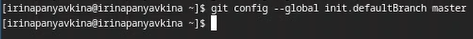

---
## Front matter
lang: ru-RU
title: Лабораторна работа №2
subtitle: Операционные системы
author:
  - Панявкина И.В.
institute:
  - Российский университет дружбы народов, Москва, Россия
date: 06 марта 2025

## i18n babel
babel-lang: russian
babel-otherlangs: english

## Formatting pdf
toc: false
toc-title: Содержание
slide_level: 2
aspectratio: 169
section-titles: true
theme: metropolis
header-includes:
 - \metroset{progressbar=frametitle,sectionpage=progressbar,numbering=fraction}
---

## Цель работы

  Цель данной лабораторной работы - изучение идеологии и применения средств контроля версий, освоение умения по работе с git.

## Задание

1. Создать базовую конфигурацию для работы с git
2. Создать ключ SSH
3. Создать ключ GPG
4. Настроить подписи Git
5. Зарегестрироваться на GitHub
6. Создать локальный каталог для выполнения заданий по предмету.

## Выполнение лабораторной работы. Установка программного обеспечения
 Устанавливаю необходимое ПО git и gh через терминал с помощью команд: 
 - dnf install git
 - dnf install gh (рис.1).

{#fig:001 width=70%}
 
## Выполнение лабораторной работы. Базовая настройка git
  Задаю в качестве имени и email владельца репозитория свои имя, фамилию и электронную почту (рис.2).
  
{#fig:002 width=70%}

## Выполнение лабораторной работы. Базовая настройка git
  Настраиваю utf-8 в выводе сообщений git для их корректного отображения (рис.3).
  
{#fig:003 width=70%}

## Выполнение лабораторной работы. Базовая настройка git
  Начальной ветке задаю имя master (рис.4).

{#fig:004 width=70%}

## Выполнение лабораторной работы. Базовая настройка git
  Задаю параметры autocrlf и safecrlf для корректного отображения конца строки (рис.5).
  
{#fig:005 width=70%}

## Выполнение лабораторной работы. Создание ключа SSH
  Создаю ключ ssh размером 4096 бит по алгоритму rsa (рис.6).

{#fig:006 width=70%}

## Выполнение лабораторной работы. Создание ключа SSH
  Создаю ключ ssh по алгоритму ed25519 (рис.7).
  
{#fig:007 width=70%}

## Выполнение лабораторной работы. Создание ключа GPG
  - генерирую ключ GPG, затем выбираю тип ключа RSA и RSA,
  - задаю максимальную длину ключа 4096, оставляю неограниченный срок действия ключа.
  - даю ответы на вопросы программы о личной информации (рис.8).
  
{#fig:008 width=70%}

## Выполнение лабораторной работы. Создание ключа GPG
  Ввожу фразу-пароль для защиты нового ключа (рис.9).
  
{#fig:009 width=70%}

## Выполнение лабораторной работы. Регистрация на GitHub
  Аккаунт на GitHub я уже создавала, основные данные уже заполнены и проведена его настройка, просто вхожу в свой аккаунт (рис.10).

{#fig:010 width=70%}

## Выполнение лабораторной работы. Добавление ключа GPG на GitHub
  - вывожу список созданных ключей в терминал,
  - ищу в результате запроса отпечаток ключа
  - копирую его в буфер обмена.(рис.11).
  
{#fig:011 width=70%}

## Выполнение лабораторной работы. Добавление ключа GPG на GitHub
  К сожалению, скопировать ключ с помощью утилиты xclip, введя следующую команду gpg --armor --export отпечаток ключа | xclip -sel clip,не удалось (происходила вставка предыдущего скопированного элемента), пришлось скопировать вручную с помощью команды для просмотра буфера обмена xclip -sel clip -o. (рис.12).

{#fig:012 width=70%}

## Выполнение лабораторной работы. Добавление ключа GPG на GitHub
  Открываю настройки GitHub, ищу среди них добавление GPG ключа (рис.13).
  
{#fig:013 width=70%}

## Выполнение лабораторной работы. Добавление ключа GPG на GitHub
  Нажимаю на "New GPG key" и вставляю в поле ключ из буфера обмена (рис.14).
  
{#fig:014 width=70%}

## Выполнение лабораторной работы. Добавление ключа GPG на GitHub
  Ключ GPG успешно добавлен на GitHub (рис.15).
  
{#fig:015 width=70%}

## Выполнение лабораторной работы. Настроить подписи Git
  Настраиваю автоматические подписи коммитов git (рис.16).
  
{#fig:016 width=70%}

## Выполнение лабораторной работы. Настройка gh
  - начинаю авторизацию в gh,
  - отвечаю на наводящие вопросы от утилиты, 
  - выбираю авторизоваться через браузер (рис.17).

{#fig:017 width=70%}

## Выполнение лабораторной работы. Настройка gh
  Завершаю авторизацию на сайте (рис.18).

{#fig:018 width=70%}

## Выполнение лабораторной работы. Настройка gh
  Вижу сообщение о завершении авторизации под именем irinapanyavkina (рис.19).
  
{#fig:019 width=70%}

## Выполнение лабораторной работы. Создание репозитория курса на основе шаблона
  - создаю директорию с помощью утилиты mkdir и флага -p
  - с помощью утилиты cd перемещаюсь в созданную директорию "Операционные системы". 
  - ввожу команду gh repo create study_2024-2025_os-intro-template yamadharma/course =-directory-template --public
  - клонирую репозиторий к себе в директорию (рис.20).

{#fig:020 width=70%}

## Выполнение лабораторной работы. Создание репозитория курса на основе шаблона
  Перехожу в каталог курса с помощью утилиты cd, проверяю содержание каталога с помощью утилиты ls (рис.21).

{#fig:021 width=70%}

## Выполнение лабораторной работы. Создание репозитория курса на основе шаблона
  Удаляю лишние файлы с помощью утилиты rm, затем создаю необходимые каталоги используя makefile (рис.22).

{#fig:022 width=70%}

## Выполнение лабораторной работы. Создание репозитория курса на основе шаблона
  - добавляю все новые файлы для отправки на сервер (сохраняю добавленные изменения) с помощью команды git add
  - комментирую их с помощью команды git commit (рис.23).
  
{#fig:023 width=70%}

## Выполнение лабораторной работы. Создание репозитория курса на основе шаблона
  Отправляю файлы на сервер с помощью git push (рис.24).
  
{#fig:024 width=70%}

# Выводы

  При выполнении лабораторной работы я изучила идеологию и применение средств контроля версий, освоила умение по работе с git.
  
# Список литературы{.unnumbered}

::: {refs}
1. Лабораторная работа №2 [Электронный ресурс] URL: https://esystem.rudn.ru/mod/page/view.php?id=1224311
:::

