---
## Front matter
title: "Отчет по лабораторной работе №2"
subtitle: "Операционные системы"
author: "Ирина Васильевна Панявкина"

## Generic otions
lang: ru-RU
toc-title: "Содержание"

## Bibliography
bibliography: bib/cite.bib
csl: pandoc/csl/gost-r-7-0-5-2008-numeric.csl

## Pdf output format
toc: true # Table of contents
toc-depth: 2
lof: true # List of figures
lot: true # List of tables
fontsize: 12pt
linestretch: 1.5
papersize: a4
documentclass: scrreprt
## I18n polyglossia
polyglossia-lang:
  name: russian
  options:
	- spelling=modern
	- babelshorthands=true
polyglossia-otherlangs:
  name: english
## I18n babel
babel-lang: russian
babel-otherlangs: english
## Fonts
mainfont: IBM Plex Serif
romanfont: IBM Plex Serif
sansfont: IBM Plex Sans
monofont: IBM Plex Mono
mathfont: STIX Two Math
mainfontoptions: Ligatures=Common,Ligatures=TeX,Scale=0.94
romanfontoptions: Ligatures=Common,Ligatures=TeX,Scale=0.94
sansfontoptions: Ligatures=Common,Ligatures=TeX,Scale=MatchLowercase,Scale=0.94
monofontoptions: Scale=MatchLowercase,Scale=0.94,FakeStretch=0.9
mathfontoptions:
## Biblatex
biblatex: true
biblio-style: "gost-numeric"
biblatexoptions:
  - parentracker=true
  - backend=biber
  - hyperref=auto
  - language=auto
  - autolang=other*
  - citestyle=gost-numeric
## Pandoc-crossref LaTeX customization
figureTitle: "Рис."
tableTitle: "Таблица"
listingTitle: "Листинг"
lofTitle: "Список иллюстраций"
lotTitle: "Список таблиц"
lolTitle: "Листинги"
## Misc options
indent: true
header-includes:
  - \usepackage{indentfirst}
  - \usepackage{float} # keep figures where there are in the text
  - \floatplacement{figure}{H} # keep figures where there are in the text
---

# Цель работы

  Цель данной лабораторной работы - изучение идеологии и применения средств контроля версий, освоение умения по работе с git.

# Задание

1. Создать базовую конфигурацию для работы с git
2. Создать ключ SSH
3. Создать ключ GPG
4. Настроить подписи Git
5. Зарегестрироваться на GitHub
6. Создать локальный каталог для выполнения заданий по предмету.

# Выполнение лабораторной работы

## Установка программного обеспечения
 Устанавливаю необходимое программное обеспечение git и gh через терминал с помощью команд: dnf install git  и dnf install gh (рис.[-@fig:001]).

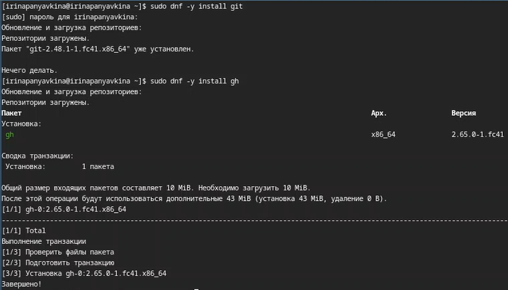{#fig:001 width=70%}
 
## Базовая настройка git
  Задаю в качестве имени и email владельца репозитория свои имя, фамилию и электронную почту (рис.[-@fig:002]).
  
{#fig:002 width=70%}

  Настраиваю utf-8 в выводе сообщений git для их корректного отображения (рис.[-@fig:003]).
  
{#fig:003 width=70%}

  Начальной ветке задаю имя master (рис.[-@fig:004]).
  
{#fig:004 width=70%}

  Задаю параметры autocrlf и safecrlf для корректного отображения конца строки (рис.[-@fig:005]).
  
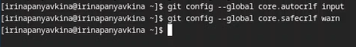{#fig:005 width=70%}

## Создание ключа SSH
  Создаю ключ ssh размером 4096 бит по алгоритму rsa (рис.[-@fig:006]).

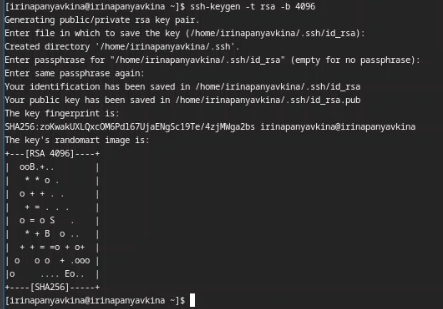{#fig:006 width=70%}

  Создаю ключ ssh по алгоритму ed25519 (рис.[-@fig:007]).
  
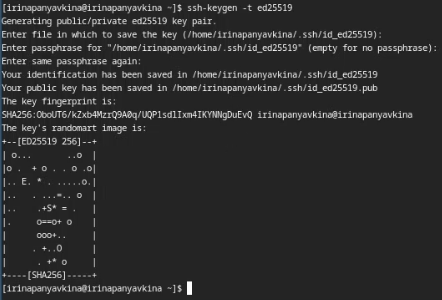{#fig:007 width=70%}

## Создание ключа GPG
  Генерирую ключ GPG, затем выбираю тип ключа RSA и RSA, задаю максимальную длину ключа 4096, оставляю неограниченный срок действия ключа. Затем даю ответы на вопросы программы о личной информации (рис.[-@fig:008]).
  
{#fig:008 width=70%}

  Ввожу фразу-пароль для защиты нового ключа (рис.[-@fig:009]).
  
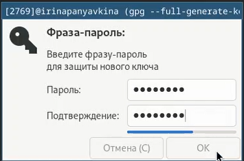{#fig:009 width=70%}

## Регистрация на GitHub
  Аккаунт на GitHub я уже создавала, поэтому основные данные уже заполнены и проведена его настройка, тогда просто вхожу в свой аккаунт (рис.[-@fig:010]).

{#fig:010 width=70%}

## Добавление ключа GPG на GitHub
  Вывожу список созданных ключей в терминал, ищу в результате запроса отпечаток ключа (последовательность байтов для идентификации более длинного, по сравнению с самим отпечатком, ключа), он находится после знака слеш, копирую его в буфер обмена.(рис.[-@fig:011]).
  
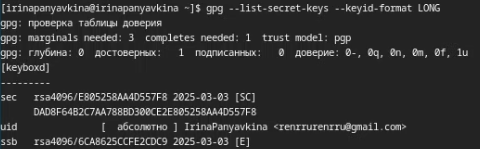{#fig:011 width=70%}

  К сожалению, скопировать ключ с помощью утилиты xclip, введя следующую команду gpg --armor --export отпечаток ключа | xclip -sel clip, мне не удалось, как бы я не пыталась (происходила вставка предыдущего скопированного элемента), поэтому пришлось сделать это вручную с помощью команды для просмотра буфера обмена xclip -sel clip -o. (рис.[-@fig:012]).

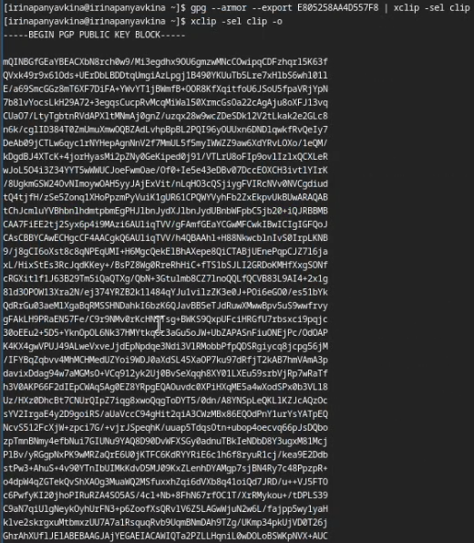{#fig:012 width=70%}

  Открываю настройки GitHub, ищу среди них добавление GPG ключа (рис.[-@fig:013]).
  
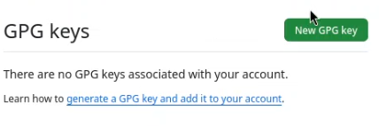{#fig:013 width=70%}

  Нажимаю на "New GPG key" и вставляю в поле ключ из буфера обмена (рис.[-@fig:014]).
  
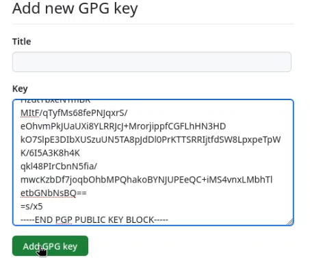{#fig:014 width=70%}
  
  Ключ GPG успешно добавлен на GitHub (рис.[-@fig:015]).
  
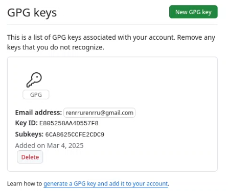{#fig:015 width=70%}

## Настроить подписи Git
  Настраиваю автоматические подписи коммитов git: используя введённый ранее email, указываю git использовать его при создании подписей коммитов (рис.[-@fig:016]).
  
{#fig:016 width=70%}

## Настройка gh
  Начинаю авторизацию в gh, отвечаю на наводящие вопросы от утилиты, в конце выбираю авторизоваться через браузер (рис.[-@fig:017]).

{#fig:017 width=70%}

  Завершаю авторизацию на сайте (рис.[-@fig:018]).

{#fig:018 width=70%}.

  Вижу сообщение о завершении авторизации под именем irinapanyavkina (рис.[-@fig:019]).
  
{#fig:019 width=70%}

## Создание репозитория курса на основе шаблона
  Сначала я создаю директорию с помощью утилиты mkdir и флага -p, который позволяет установить каталоги на всем указанном пути. Затем с помощью утилиты cd перемещаюсь в созданную директорию "Операционные системы". После этого в терминале ввожу команду gh repo create study_2024-2025_os-intro-template yamadharma/course =-directory-template --public, для тогог чтобы создать репозиторий на основе шаблона репозитория. Далее клонирую репозиторий к себе в директорию, указываю ссылку с протоколом https, а не ssh, потому что во время авторизации в gh, я выбрала протокол https (рис.[-@fig:020]).

{#fig:020 width=70%}

  Перехожу в каталог курса с помощью утилиты cd, проверяю содержание каталога с помощью утилиты ls (рис.[-@fig:021]).

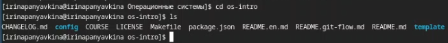{#fig:021 width=70%}

  Удаляю лишние файлы с помощью утилиты rm, затем создаю необходимые каталоги используя makefile (рис.[-@fig:022]).

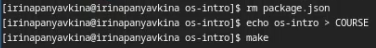{#fig:022 width=70%}.

  Добавляю все новые файлы для отправки на сервер (сохраняю добавленные изменения) с помощью команды git add и комментирую их с помощью команды git commit (рис.[-@fig:023]).
  
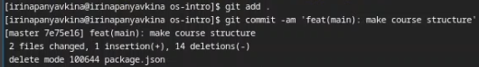{#fig:023 width=70%}

  Отправляю файлы на сервер с помощью git push (рис.[-@fig:024]).
  
{#fig:024 width=70%}

# Выводы

  При выполнении лабораторной работы я изучила идеологию и применение средств контроля версий, освоила умение по работе с git.
  
# Ответы на контрольные вопросы
 1. Системы контроля версий (VCS) - программное обеспечение для облегчения работы с изменяющейся информацией. Они позволяют хранить несколько версий изменяющейся информации, одного и того же документа, может предоставить доступ к более ранним версиям документа. Используется для работы нескольких человек над проектом, позволяет посмотреть, кто и когда внес какое-либо изменение и т. д. VCS ррименяются для: Хранения понлой истории изменений, сохранения причин всех изменений, поиска причин изменений и совершивших изменение, совместной работы над проектами.
 2. Хранилище -- репозиторий, хранилище версий, в нем хранятся все документы, включая историю их изменения и прочей служебной информацией. commit -- отслеживание изменений, сохраняет разницу в изменениях. История -- хранит все изменения в проекте и позволяет при необходимости вернуться/обратиться к нужным данным. Рабочая копия -- копия проекта, основанная на версии из хранилища, чаще всего последней версии.
 3. Централизованные VCS (например: CVS, TFS, AccuRev) -- одно основное хранилище всего проекта. Каждый пользователь копирует себе необходимые ему файлы из этого репозитория, изменяет, затем добавляет изменения обратно в хранилище. Децентрализованные VCS (например: Git, Bazaar) -- у каждого пользователя свой вариант репозитория (возможно несколько вариантов), есть возможность добавлять и забирать изменения из любого репозитория. В отличие от классических, в распределенных (децентралиованных) системах контроля версий центральный репозиторий не является обязательным.
 4. Сначала создается и подключается удаленный репозиторий, затем по мере изменения проекта эти изменения отправляются на сервер.
 5. Участник проекта перед началом работы получает нужную ему версию проекта в хранилище, с помощью определенных команд, после внесения изменений пользователь размещает новую версию в хранилище. При этом предыдущие версии не удаляются. К ним можно вернуться в любой момент.
 6. Хранение информации о всех изменениях в вашем коде, обеспечение удобства командной работы над кодом.
 7. Создание основного дерева репозитория: git init
Получение обновлений (изменений) текущего дерева из центрального репозитория: git pull
Отправка всех произведённых изменений локального дерева в центральный репозиторий: git push
Просмотр списка изменённых файлов в текущей директории: git status
Просмотр текущих изменений: git diff
Сохранение текущих изменений: добавить все изменённые и/или созданные файлы и/или каталоги: git add .
добавить конкретные изменённые и/или созданные файлы и/или каталоги: git add имена_файлов
удалить файл и/или каталог из индекса репозитория (при этом файл и/или каталог остаётся в локальной директории): git rm имена_файлов
Сохранение добавленных изменений:
сохранить все добавленные изменения и все изменённые файлы: git commit -am 'Описание коммита'
сохранить добавленные изменения с внесением комментария через встроенный редактор: git commit
создание новой ветки, базирующейся на текущей: git checkout -b имя_ветки
переключение на некоторую ветку: git checkout имя_ветки (при переключении на ветку, которой ещё нет в локальном репозитории, она будет создана и связана с удалённой)
отправка изменений конкретной ветки в центральный репозиторий: git push origin имя_ветки
слияние ветки с текущим деревом: git merge --no-ff имя_ветки
Удаление ветки:
удаление локальной уже слитой с основным деревом ветки: git branch -d имя_ветки
принудительное удаление локальной ветки: git branch -D имя_ветки
удаление ветки с центрального репозитория: git push origin :имя_ветки
8. git push -all отправляем из локального репозитория все сохраненные изменения в центральный репозиторий, предварительно создав локальный репозиторий и сделав предварительную конфигурацию.
9. Ветвление - один из параллельных участков в одном хранилище, исходящих из одной версии, обычно есть главная ветка. Между ветками, т. е. их концами возможно их слияние. Используются для разработки новых функций.
10. Во время работы над проектом могут создаваться файлы, которые не следуют добавлять в репозиторий. Например, временные файлы.

# Список литературы{.unnumbered}

::: {#esystem.rudn.ru/mod/page/view.php?id=1224311}
