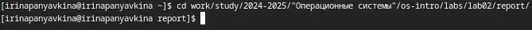
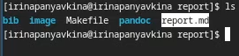
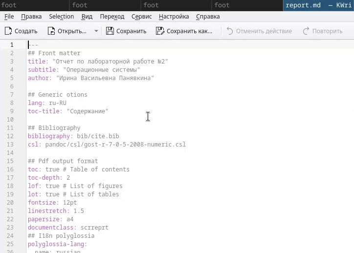
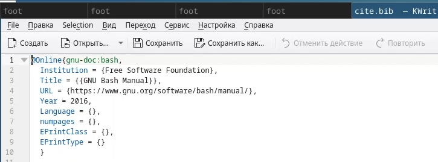
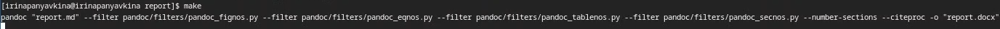
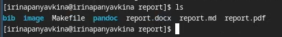
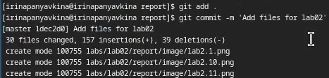
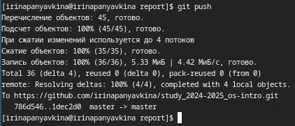

---
## Front matter
lang: ru-RU
title: Лабораторная работа №3
subtitle: Операционные системы
author:
  - Панявкина И.В.
institute:
  - Российский университет дружбы народов, Москва, Россия
date: 06 марта 2025

## i18n babel
babel-lang: russian
babel-otherlangs: english

## Formatting pdf
toc: false
toc-title: Содержание
slide_level: 2
aspectratio: 169
section-titles: true
theme: metropolis
header-includes:
 - \metroset{progressbar=frametitle,sectionpage=progressbar,numbering=fraction}
---

## Цель работы

  Цель данной лабораторной работы - научиться оформлять отчёты с помощью легковесного языка разметки Markdown.

## Задание

1. Сделать отчёт по предыдущей лабораторной работе в формате Markdown.
2. В качестве отчёта предоставить отчёты в 3 форматах: pdf, docx и md (в архиве, поскольку он должен содержать скриншоты, Makefile и т.д.)

## Теоретическое введение

  Markdown - облегчённый язык разметки, созданный с целью обозначения форматирования в простом тексте, с максимальным сохраниением его читаемости человеком, и прогодный для машинного преобразованиея в языки для продвинутых публикаций.
  
## Выполнение лабораторной работы

  Перехожу в каталог, в котором находится шаблон для отчета по лабораторной работе, с помощью утилиты cd (рис.1).

{#fig:001 width=70%}

## Выполнение лабораторной работы
  Проверяю наличие шаблона, в котором я буду работать, в директории с помощью утилиты ls (рис.2).

{#fig:002 width=70%}

## Выполнение лабораторной работы
  Открываю файл report.md с помощью текстового редактора Kwrite и редактирую его (рис.3).

{#fig:003 width=70%}

## Выполнение лабораторной работы
  В файле cite.bib с помощью текстового редактора Kwrite поработала над списком библиографии, вставив использовавшийся интернет-ресурс (рис.4).

{#fig:004 width=70%}

## Выполнение лабораторной работы
  После изменения шаблона в соответствии с языком разметки Markdown, я выполнила его компиляцию из формата md в форматы docx и pdf с помощью команды make (рис.5).
  
{#fig:005 width=70%}

## Выполнение лабораторной работы
  Проверяю прошла ли успешно компиляция отчёта с помощью команды ls. (рис.6).

{#fig:006 width=70%}

## Выполнение лабораторной работы
  Затем подготавливаю к отправке созданные и скомпилированные файлы на глобальный репозиторий (рис.7).

{#fig:007 width=70%}

## Выполнение лабораторной работы
  И отправляю файлы на Git с помощью команды git push (рис.8).
  
{#fig:008 width=70%}

## Выводы

  При выполнении данной лабораторной работы я научилась оформлять отчёты с помощью легковесного языка разметки Markdown.

## Список литературы{.unnumbered}

1. Лабораторная работа №3 [Электронный ресурс] URL: https://esystem.rudn.ru/pluginfile.php/2586858/mod_resource/content/3/003-lab_markdown.pdf

