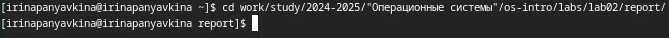
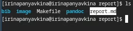
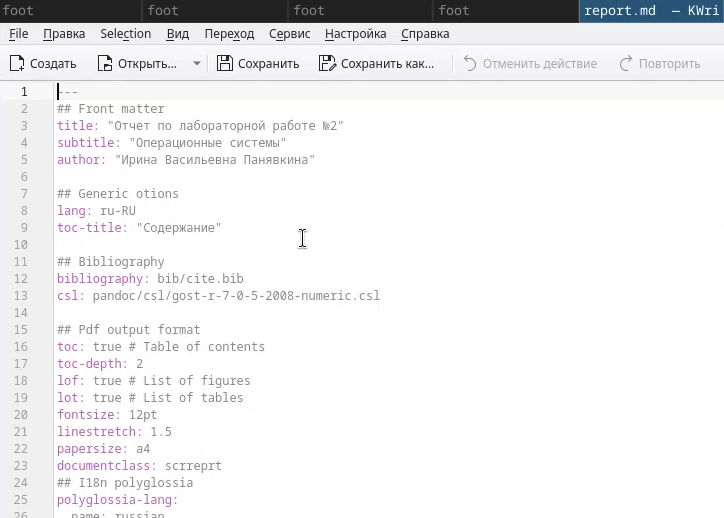
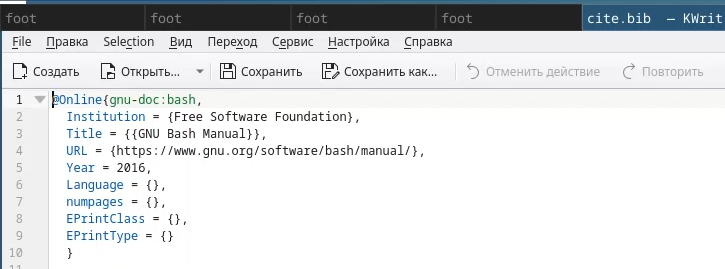
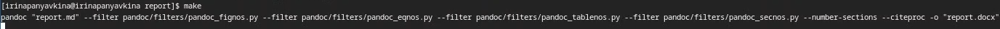
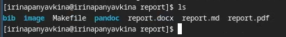
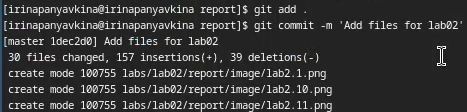
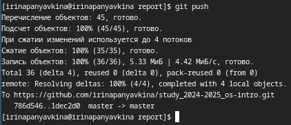

---
## Front matter
title: "Отчёт по лабораторной работе №3"
subtitle: "Операционные системы"
author: "Ирина Васильевна Панявкина"

## Generic otions
lang: ru-RU
toc-title: "Содержание"

## Bibliography
bibliography: bib/cite.bib
csl: pandoc/csl/gost-r-7-0-5-2008-numeric.csl

## Pdf output format
toc: true # Table of contents
toc-depth: 2
lof: true # List of figures
lot: true # List of tables
fontsize: 12pt
linestretch: 1.5
papersize: a4
documentclass: scrreprt
## I18n polyglossia
polyglossia-lang:
  name: russian
  options:
	- spelling=modern
	- babelshorthands=true
polyglossia-otherlangs:
  name: english
## I18n babel
babel-lang: russian
babel-otherlangs: english
## Fonts
mainfont: IBM Plex Serif
romanfont: IBM Plex Serif
sansfont: IBM Plex Sans
monofont: IBM Plex Mono
mathfont: STIX Two Math
mainfontoptions: Ligatures=Common,Ligatures=TeX,Scale=0.94
romanfontoptions: Ligatures=Common,Ligatures=TeX,Scale=0.94
sansfontoptions: Ligatures=Common,Ligatures=TeX,Scale=MatchLowercase,Scale=0.94
monofontoptions: Scale=MatchLowercase,Scale=0.94,FakeStretch=0.9
mathfontoptions:
## Biblatex
biblatex: true
biblio-style: "gost-numeric"
biblatexoptions:
  - parentracker=true
  - backend=biber
  - hyperref=auto
  - language=auto
  - autolang=other*
  - citestyle=gost-numeric
## Pandoc-crossref LaTeX customization
figureTitle: "Рис."
tableTitle: "Таблица"
listingTitle: "Листинг"
lofTitle: "Список иллюстраций"
lotTitle: "Список таблиц"
lolTitle: "Листинги"
## Misc options
indent: true
header-includes:
  - \usepackage{indentfirst}
  - \usepackage{float} # keep figures where there are in the text
  - \floatplacement{figure}{H} # keep figures where there are in the text
---

# Цель работы

  Цель данной лабораторной работы - научиться оформлять отчёты с помощью легковесного языка разметки Markdown.

# Задание

1. Сделать отчёт по предыдущей лабораторной работе в формате Markdown.
2. В качестве отчёта предоставить отчёты в 3 форматах: pdf, docx и md (в архиве, поскольку он должен содержать скриншоты, Makefile и т.д.)

# Теоретическое введение

  Markdown - облегчённый язык разметки, созданный с целью обозначения форматирования в простом тексте, с максимальным сохраниением его читаемости человеком, и прогодный для машинного преобразованиея в языки для продвинутых публикаций.
  
# Выполнение лабораторной работы

  Перехожу в каталог, в котором находится шаблон для отчета по лабораторной работе, с помощью утилиты cd (рис.[-@fig:001]).

{#fig:001 width=70%}

  Проверяю наличие шаблона, в котором я буду работать, в директории с помощью утилиты ls (рис.[-@fig:002]).

{#fig:002 width=70%}

  Открываю файл report.md с помощью текстового редактора Kwrite и редактирую его (рис.[-@fig:003]).

{#fig:003 width=70%}

  В файле cite.bib с помощью текстового редактора Kwrite поработала над списком библиографии, вставив использовавшийся интернет-ресурс (рис.[-@fig:004]).

{#fig:004 width=70%}

  После изменения шаблона в соответствии с языком разметки Markdown, я выполнила егоо компиляцию из формата md в форматы docx и pdf  с помощью команды make (рис.[-@fig:005]).
  
{#fig:005 width=70%}
  
  Проверяю прошла ли успешно компиляция отчёта с помощью команды ls. (рис.[-@fig:006]).

{#fig:006 width=70%}

  Затем подготавливаю к отправке созданные и скомпилированные файлы на глобальный репозиторий (рис.[-@fig:007]).

{#fig:007 width=70%}

  И отправляю файлы на Git с помощью команды git push (рис.[-@fig:008]).
  
{#fig:008 width=70%}

# Выводы

  При выполнении данной лабораторной работы я научилась оформлять отчёты с помощью легковесного языка разметки Markdown.

# Список литературы{.unnumbered}

1. Лабораторная работа №3 [Электронный ресурс] URL: https://esystem.rudn.ru/pluginfile.php/2586858/mod_resource/content/3/003-lab_markdown.pdf
