---
## Front matter
lang: ru-RU
title: Лабораторная работа №4
subtitle: Операционные системы
author:
  - Панявкина И.В.
institute:
  - Российский университет дружбы народов, Москва, Россия

date: 07 марта 2025

## i18n babel
babel-lang: russian
babel-otherlangs: english

## Formatting pdf
toc: false
toc-title: Содержание
slide_level: 2
aspectratio: 169
section-titles: true
theme: metropolis
header-includes:
 - \metroset{progressbar=frametitle,sectionpage=progressbar,numbering=fraction}
---

## Цель работы

  Цель данной лабораторной работы - получение навыков правильной работы с репозиториями git.

## Задание

1. Выполнить работу для тестового репозитория.
2. Преобразовать рабочий репозиторий в репозиторий с git-flow и conventional commits.

## Теоретическое введение

  Рабочий процесс Gitflow Workflow. Будем описывать его с использованием пакета git-flow.
Общая информация:
- Gitflow Workflow опубликована и популяризована Винсентом Дриссеном.
- Gitflow Workflow предполагает выстраивание строгой модели ветвления с учётом выпуска проекта.
- Данная модель отлично подходит для организации рабочего процесса на основе релизов.
- Работа по модели Gitflow включает создание отдельной ветки для исправлений ошибок в рабочей среде.
- Последовательность действий при работе по модели Gitflow:
  - Из ветки master создаётся ветка develop.
  - Из ветки develop создаётся ветка release.
  - Из ветки develop создаются ветки feature.
  - Когда работа над веткой feature завершена, она сливается с веткой develop.
  - Когда работа над веткой релиза release завершена, она сливается в ветки develop и master.
  - Если в master обнаружена проблема, из master создаётся ветка hotfix.
  - Когда работа над веткой исправления hotfix завершена, она сливается в ветки develop и master.

## Выполнение лабораторной работы. Установка программного обеспечения
  На Node.js базируется программное обеспечение для семантического версионирования и общепринятых коммитов, поэтому первым делом устанавливаю nodejs и pnpm (рис.1).

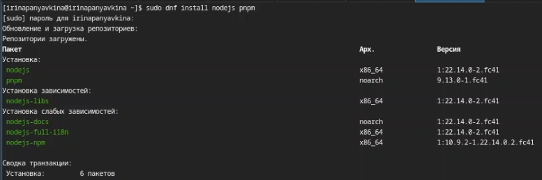{#fig:001 width=70%}

## Выполнение лабораторной работы. Установка программного обеспечения
  К сожалению, скачать gitflow по инструкции мне не удалось, поэтому делала я это иным способом. Сначала скачиваю установщик gitflow - gitflow-installer, с помощью команды ls проверяю успешна ли загрузка (рис.2).
  
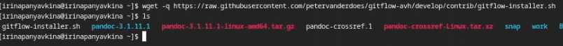{#fig:002 width=70%}

## Выполнение лабораторной работы. Установка программного обеспечения
  Теперь устанавливаю gitflow через установщик (рис.3).

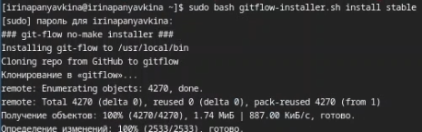{#fig:003 width=70%}

## Выполнение лабораторной работы. Установка программного обеспечения
  Установщик больше не потребуется, удаляю его с помощью команды rm (рис.4).
 
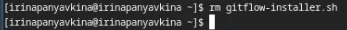{#fig:004 width=70%}

## Выполнение лабораторной работы. Установка программного обеспечения
  Затем настраиваю nodejs. Для работы с Node.js добавим каталог с исполняемыми файлами, устанавливаемыми yarn, в переменную PATH (рис.5).

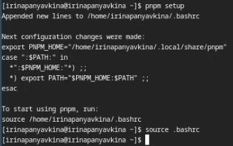{#fig:005 width=70%}

## Выполнение лабораторной работы. Установка программного обеспечения
  Настраиваю общепринятые коммиты. Добавляю commitizen - программа используется для помощи в форматировании коммитов. (рис.6).
  
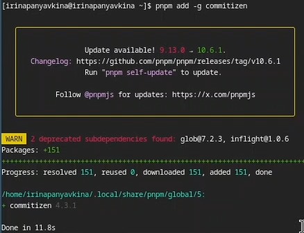{#fig:006 width=70%}

## Выполнение лабораторной работы. Установка программного обеспечения
  Также добавляю standard-changelog - программа используется для помощи в создании логов (рис.7).
  
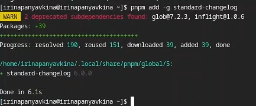{#fig:007 width=70%}

## Выполнение лабораторной работы. Практический сценарий использования git

  Создаю публичный репозиторий на GitHub с помощью команды gh repo create --public и называю его git-extended (рис.8).

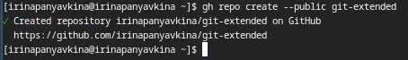{#fig:008 width=70%}

## Выполнение лабораторной работы. Практический сценарий использования git
  Теперь клонирую его к себе на виртуальную машину (рис.9).

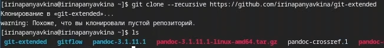{#fig:009 width=70%}

## Выполнение лабораторной работы. Практический сценарий использования git
  Перемещаюсь в git-extended/ и создаю файл README.md, пишу в нем "text". Мне это необходимо для создания первого коммита (рис.10).
  
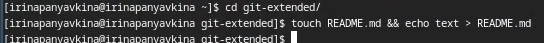{#fig:010 width=70%}

## Выполнение лабораторной работы. Практический сценарий использования git
- Добавляю изменения через git add .
- делаю первый коммит с помощью git commit -m "first commit"
- выкладываю на github через git push (рис.11).

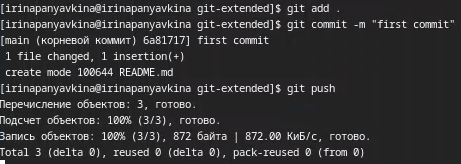{#fig:011 width=70%}

## Выполнение лабораторной работы. Практический сценарий использования git
  Приступим к конфигурации общепринятых коммитов. Осуществляю конфигурацию для пакетов Node.js (рис.12).

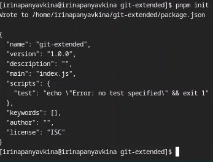{#fig:012 width=70%}

## Выполнение лабораторной работы. Практический сценарий использования git
  Редактирую файл package.json. Заполняю несколько параметров пакета (рис.13).

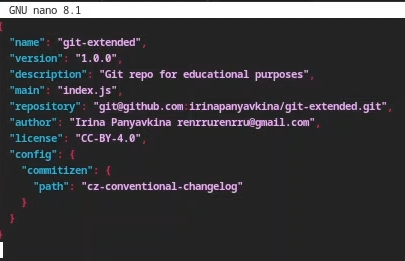{#fig:013 width=70%}

## Выполнение лабораторной работы. Практический сценарий использования git
- Добавляю новые файлы через git add .
- выполняю коммит по новой команде git cz
- отправляю на github через git push (рис.14).
  
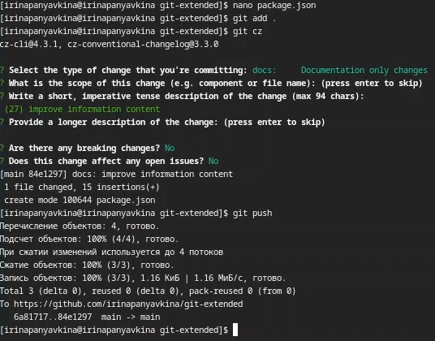{#fig:014 width=70%}

## Выполнение лабораторной работы. Практический сценарий использования git
  Осуществим конфигурацию git-flow. Инициализирую git-flow с помощью команды git flow init. Префикс для ярлыков установливаю в v. (рис.15]).

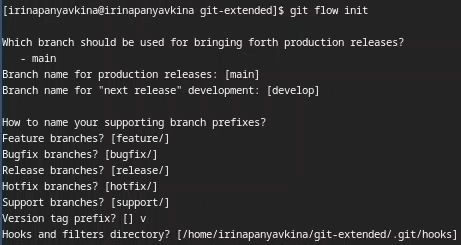{#fig:015 width=70%}
 
## Выполнение лабораторной работы. Практический сценарий использования git
  Проверяю, что я нахожусь на ветке develop: git branch (рис.16).
  
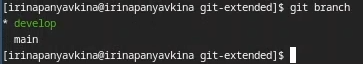{#fig:016 width=70%}

## Выполнение лабораторной работы. Практический сценарий использования git
  Загружаю весь репозиторий в хранилище через команду push --all (рис.17).
  
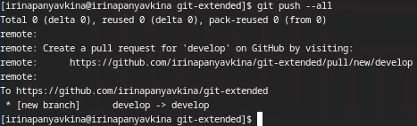{#fig:017 width=70%}

## Выполнение лабораторной работы. Практический сценарий использования git
  Устанавливаю внешнюю ветку как вышестоящую для этой ветки командой git branch --set-upstream-to=origin/develop develop (рис.18).
  
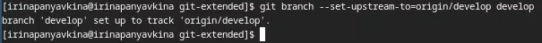{#fig:018 width=70%}

## Выполнение лабораторной работы. Практический сценарий использования git
  Создаю релиз с версией 1.0.0 (рис.19).

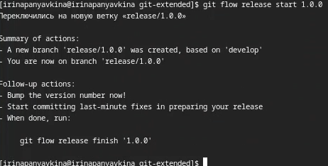{#fig:019 width=70%}

## Выполнение лабораторной работы. Практический сценарий использования git
  Создаю журнал изменений и добавляю журнал изменений в индекс, в вопросах программы указываю 'chore(site): add changelog' (рис.20).

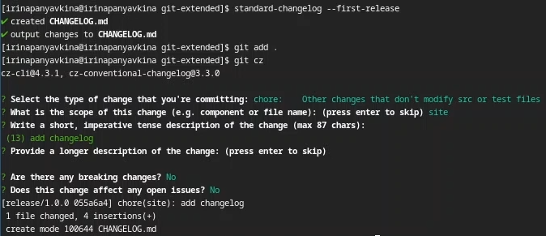{#fig:020 width=70%}

## Выполнение лабораторной работы. Практический сценарий использования git
  Заливаю релизную ветку в основную ветку (рис.21).

{#fig:021 width=70%}

## Выполнение лабораторной работы. Практический сценарий использования git
  Указываю версию релиза 1.0.0 в открывшемся файле (рис.22).

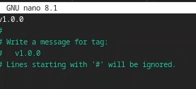{#fig:022 width=70%}

## Выполнение лабораторной работы. Практический сценарий использования git
  Отправляю данные на github, используя две команды 
- git push --all
- git push --tags (рис.23).

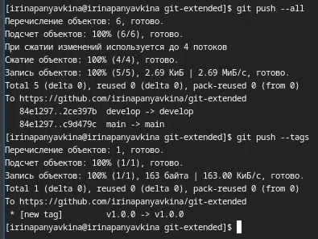{#fig:023 width=70%}

## Выполнение лабораторной работы. Практический сценарий использования git
  Создаю релиз на github. Для этого использую утилиты работы с github. (рис.24).

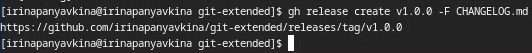{#fig:024 width=70%}

## Выполнение лабораторной работы. Работа с репозиторием git

  Перехожу к разработке новой функциональности. Создаю ветку для новой функциональности (рис. 25).

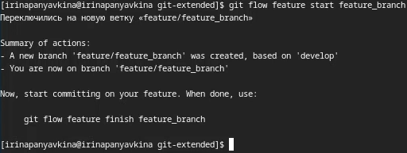{#fig:025 width=70%}

## Выполнение лабораторной работы. Работа с репозиторием git
  Проверяю, что я нахожусь на ветке feture/feature_branch (рис.26).
  
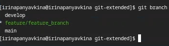{#fig:026 width=70%}

## Выполнение лабораторной работы. Работа с репозиторием git
  Создаю новый релиз с версией 1.2.3 (рис.27).

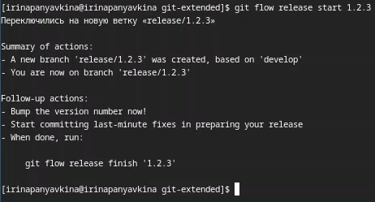{#fig:027 width=70%}

## Выполнение лабораторной работы. Работа с репозиторием git
  Редактирую файл package.json. Обновляю версию релиза на 1.2.3. (рис.28).

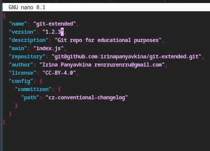{#fig:028 width=70%}

## Выполнение лабораторной работы. Работа с репозиторием git
  Создаю журнал изменений (рис.29).
  
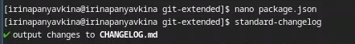{#fig:029 width=70%}  

## Выполнение лабораторной работы. Работа с репозиторием git
- Теперь добавляю новые файлы через git add ., 
- с помощью git status проверяю изменения, 
- выполняю коммит команде git cz, 
- добавляю журнал изменений в индекс, в вопросах программы указываю 'chore(site): update changelog' (рис.30).
  
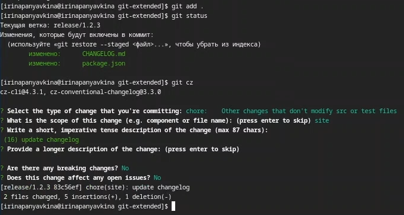{#fig:030 width=70%}

## Выполнение лабораторной работы. Работа с репозиторием git
  Заливаю релизную ветку в основную ветку (рис.31).

{#fig:031 width=70%}

## Выполнение лабораторной работы. Работа с репозиторием git
  Указываю версию релиза 1.2.3 в открывшемся файле (рис.32).

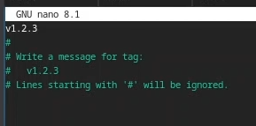{#fig:032 width=70%}

## Выполнение лабораторной работы. Работа с репозиторием git
  Отправляю данные на github, используя две команды git push --all и git push --tags (рис.33).

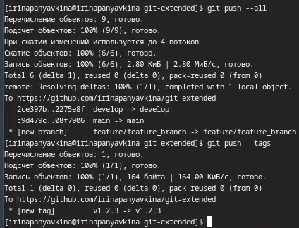{#fig:033 width=70%}

## Выполнение лабораторной работы. Работа с репозиторием git
  Создаю релиз на github. Для этого использую утилиты работы с github. (рис.34).

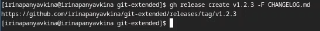{#fig:034 width=70%}

## Выводы

  Во время выполнения лабораторной работы, я получила навыки правильной работы с репозиториями git.

## Список литературы{.unnumbered}

1. Лабораторная работа №4 [Электронный ресурс] URL: https://esystem.rudn.ru/mod/page/view.php?id=1224375
