---
## Front matter
title: "Отчёт по лабораторной работе №4"
subtitle: "Операционные системы"
author: "Ирина Васильевна Панявкина"

## Generic otions
lang: ru-RU
toc-title: "Содержание"

## Bibliography
bibliography: bib/cite.bib
csl: pandoc/csl/gost-r-7-0-5-2008-numeric.csl

## Pdf output format
toc: true # Table of contents
toc-depth: 2
lof: true # List of figures
lot: true # List of tables
fontsize: 12pt
linestretch: 1.5
papersize: a4
documentclass: scrreprt
## I18n polyglossia
polyglossia-lang:
  name: russian
  options:
	- spelling=modern
	- babelshorthands=true
polyglossia-otherlangs:
  name: english
## I18n babel
babel-lang: russian
babel-otherlangs: english
## Fonts
mainfont: IBM Plex Serif
romanfont: IBM Plex Serif
sansfont: IBM Plex Sans
monofont: IBM Plex Mono
mathfont: STIX Two Math
mainfontoptions: Ligatures=Common,Ligatures=TeX,Scale=0.94
romanfontoptions: Ligatures=Common,Ligatures=TeX,Scale=0.94
sansfontoptions: Ligatures=Common,Ligatures=TeX,Scale=MatchLowercase,Scale=0.94
monofontoptions: Scale=MatchLowercase,Scale=0.94,FakeStretch=0.9
mathfontoptions:
## Biblatex
biblatex: true
biblio-style: "gost-numeric"
biblatexoptions:
  - parentracker=true
  - backend=biber
  - hyperref=auto
  - language=auto
  - autolang=other*
  - citestyle=gost-numeric
## Pandoc-crossref LaTeX customization
figureTitle: "Рис."
tableTitle: "Таблица"
listingTitle: "Листинг"
lofTitle: "Список иллюстраций"
lotTitle: "Список таблиц"
lolTitle: "Листинги"
## Misc options
indent: true
header-includes:
  - \usepackage{indentfirst}
  - \usepackage{float} # keep figures where there are in the text
  - \floatplacement{figure}{H} # keep figures where there are in the text
---

# Цель работы

  Цель данной лабораторной работы - получение навыков правильной работы с репозиториями git.

# Задание

1. Выполнить работу для тестового репозитория.
2. Преобразовать рабочий репозиторий в репозиторий с git-flow и conventional commits.

# Теоретическое введение

  Рабочий процесс Gitflow Workflow. Будем описывать его с использованием пакета git-flow.
Общая информация:
- Gitflow Workflow опубликована и популяризована Винсентом Дриссеном.
- Gitflow Workflow предполагает выстраивание строгой модели ветвления с учётом выпуска проекта.
- Данная модель отлично подходит для организации рабочего процесса на основе релизов.
- Работа по модели Gitflow включает создание отдельной ветки для исправлений ошибок в рабочей среде.
- Последовательность действий при работе по модели Gitflow:
  - Из ветки master создаётся ветка develop.
  - Из ветки develop создаётся ветка release.
  - Из ветки develop создаются ветки feature.
  - Когда работа над веткой feature завершена, она сливается с веткой develop.
  - Когда работа над веткой релиза release завершена, она сливается в ветки develop и master.
  - Если в master обнаружена проблема, из master создаётся ветка hotfix.
  - Когда работа над веткой исправления hotfix завершена, она сливается в ветки develop и master.

# Выполнение лабораторной работы

## Установка программного обеспечения

  На Node.js базируется программное обеспечение для семантического версионирования и общепринятых коммитов, поэтому первым делом устанавливаю nodejs и pnpm (рис. [-@fig:001]).

{#fig:001 width=70%}

  К сожалению, скачать gitflow по инструкции мне не удалось, поэтому делала я это иным способом. Сначала скачиваю установщик gitflow - gitflow-installer, с помощью команды ls проверяю успешна ли загрузка (рис. [-@fig:002]).
  
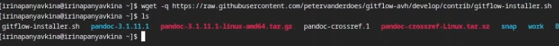{#fig:002 width=70%}

  Теперь устанавливаю gitflow через установщик (рис. [-@fig:003]).

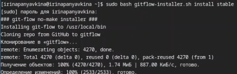{#fig:003 width=70%}

  Установщик больше не потребуется, удаляю его с помощью команды rm (рис. [-@fig:004]).
  
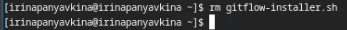{#fig:004 width=70%}

  Затем настраиваю nodejs. Для работы с Node.js добавим каталог с исполняемыми файлами, устанавливаемыми yarn, в переменную PATH (рис. [-@fig:005]).

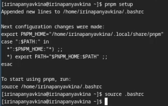{#fig:005 width=70%}

  Настраиваю общепринятые коммиты. Добавляю commitizen - программа используется для помощи в форматировании коммитов. (рис. [-@fig:006]).
  
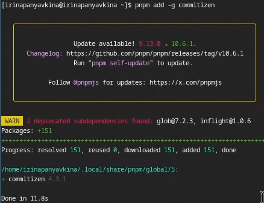{#fig:006 width=70%}

  Также добавляю standard-changelog - программа используется для помощи в создании логов (рис. [-@fig:007]).
  
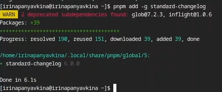{#fig:007 width=70%}

## Практический сценарий использования git

  Создаю публичный репозиторий на GitHub с помощью команды gh repo create --public и называю его git-extended (рис. [-@fig:008]).

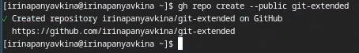{#fig:008 width=70%}

  Теперь клонирую его к себе на виртуальную машину (рис. [-@fig:009]).

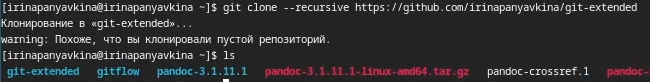{#fig:009 width=70%}

  Перемещаюсь в git-extended/ и создаю файл README.md, пишу в нем "text". Мне это необходимо для создания первого коммита (рис. [-@fig:010]).
  
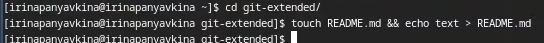{#fig:010 width=70%}

  Добавляю изменения через git add ., затем делаю первый коммит с помощью git commit -m "first commit" и выкладываю на github через git push (рис. [-@fig:011]).

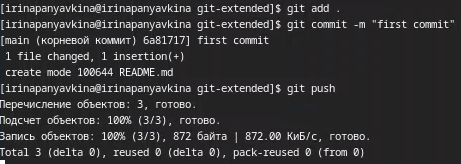{#fig:011 width=70%}

  Приступим к конфигурации общепринятых коммитов. Осуществляю конфигурацию для пакетов Node.js (рис. [-@fig:012]).

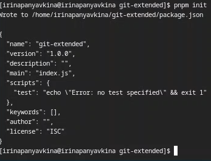{#fig:012 width=70%}

  Редактирую файл package.json. Заполняю несколько параметров пакета (рис. [-@fig:013]).

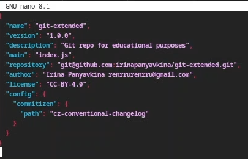{#fig:013 width=70%}

  Теперь добавляю новые файлы через git add ., выполняю коммит по новой команде git cz, отправляю на github через git push (рис. [-@fig:014]).
  
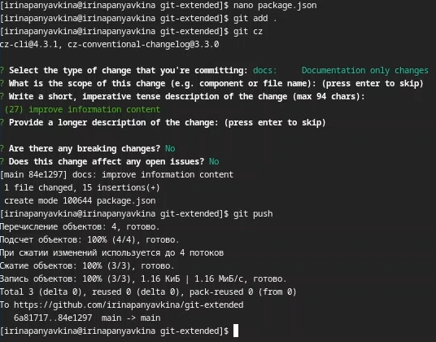{#fig:014 width=70%}

  Осуществим конфигурацию git-flow. Инициализирую git-flow с помощью команды git flow init. Префикс для ярлыков установливаю в v. (рис. [-@fig:015]).

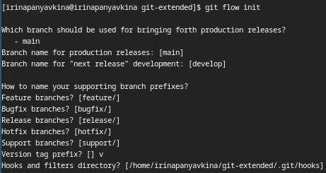{#fig:015 width=70%}
  
  Проверяю, что я нахожусь на ветке develop: git branch (рис. [-@fig:016]).
  
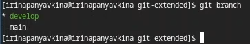{#fig:016 width=70%}

  Загружаю весь репозиторий в хранилище через команду push --all (рис. [-@fig:017]).
  
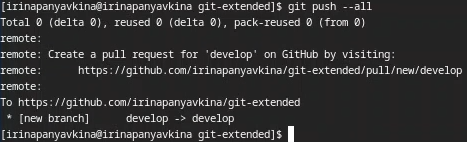{#fig:017 width=70%}

  Устанавливаю внешнюю ветку как вышестоящую для этой ветки командой git branch --set-upstream-to=origin/develop develop (рис. [-@fig:018]).
  
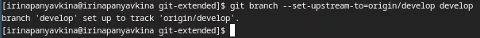{#fig:018 width=70%}

  Создаю релиз с версией 1.0.0 (рис. [-@fig:019]).

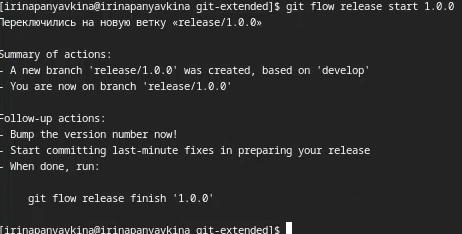{#fig:019 width=70%}

  Создаю журнал изменений и добавляю журнал изменений в индекс, в вопросах программы указываю 'chore(site): add changelog' (рис. [-@fig:020]).

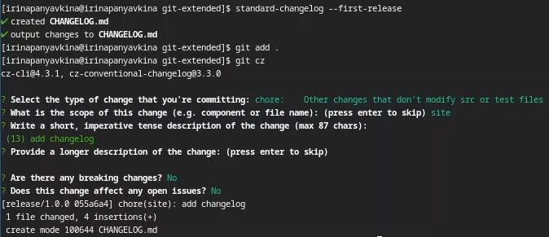{#fig:020 width=70%}

  Заливаю релизную ветку в основную ветку (рис. [-@fig:021]).

{#fig:021 width=70%}

  Указываю версию релиза 1.0.0 в открывшемся файле (рис. [-@fig:022]).

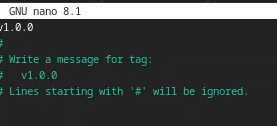{#fig:022 width=70%}

  Отправляю данные на github, используя две команды git push --all и git push --tags (рис. [-@fig:023]).

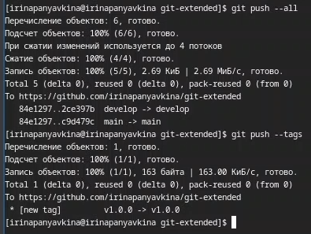{#fig:023 width=70%}

  Создаю релиз на github. Для этого использую утилиты работы с github. (рис. [-@fig:024]).

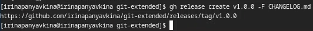{#fig:024 width=70%}

## Работа с репозиторием git

  Перехожу к разработке новой функциональности. Создаю ветку для новой функциональности (рис. [-@fig:025]).

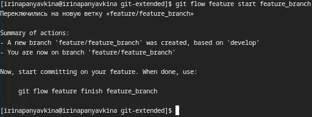{#fig:025 width=70%}
  
  Проверяю, что я нахожусь на ветке feture/feature_branch (рис. [-@fig:026]).
  
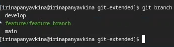{#fig:026 width=70%}

  Создаю новый релиз с версией 1.2.3 (рис. [-@fig:027]).

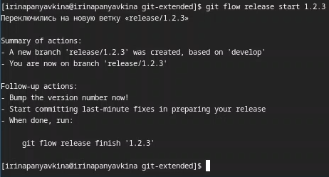{#fig:027 width=70%}

  Редактирую файл package.json. Обновляю версию релиза на 1.2.3. (рис. [-@fig:028]).

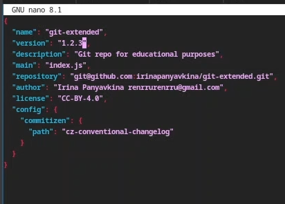{#fig:028 width=70%}

  Создаю журнал изменений (рис. [-@fig:029]).
  
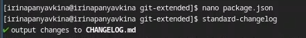{#fig:029 width=70%}  
  
  Теперь добавляю новые файлы через git add ., с помощью git status проверяю изменения, выполняю коммит команде git cz, добавляю журнал изменений в индекс, в вопросах программы указываю 'chore(site): update changelog' (рис. [-@fig:030]).
  
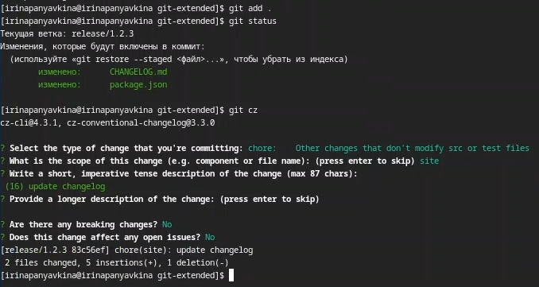{#fig:030 width=70%}

  Заливаю релизную ветку в основную ветку (рис. [-@fig:031]).

{#fig:031 width=70%}

  Указываю версию релиза 1.2.3 в открывшемся файле (рис. [-@fig:032]).

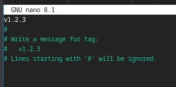{#fig:032 width=70%}

  Отправляю данные на github, используя две команды git push --all и git push --tags (рис. [-@fig:033]).

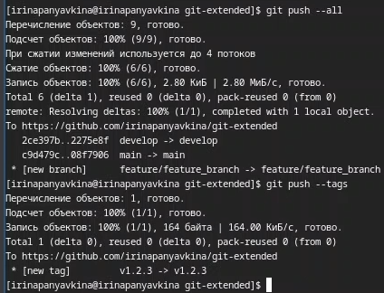{#fig:033 width=70%}

  Создаю релиз на github. Для этого использую утилиты работы с github. (рис. [-@fig:034]).

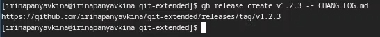{#fig:034 width=70%}

# Выводы

  Во время выполнения лабораторной работы, я получила навыки правильной работы с репозиториями git.

# Список литературы{.unnumbered}

1. Лабораторная работа №4 [Электронный ресурс] URL: https://esystem.rudn.ru/mod/page/view.php?id=1224375
