---
## Front matter
lang: ru-RU
title: Лабораторная работа №5
subtitle: Операционные системы
author:
  - Панявкина И.В.
institute:
  - Российский университет дружбы народов, Москва, Россия
date: 14 марта 2025

## i18n babel
babel-lang: russian
babel-otherlangs: english

## Formatting pdf
toc: false
toc-title: Содержание
slide_level: 2
aspectratio: 169
section-titles: true
theme: metropolis
header-includes:
 - \metroset{progressbar=frametitle,sectionpage=progressbar,numbering=fraction}
---

## Цель работы

Установка менеджера паролей pass, его настройка, а также приобретение навыков пользования данной программой.

## Задание

1. Установка и настройка менеджера паролей
2. Управление файлами конфигурации
3. Установка дополнительного программного обеспечения

## Теоретическое введение

Менеджер паролей pass — программа, сделанная в рамках идеологии Unix.
Также носит название стандартного менеджера паролей для Unix (The standard Unix password manager). Основными свойствами являются хранение данных в файловой системе в виде каталогов и файлов и шифровка файлов с помощью GPG-ключа. Структура базы паролей может быть произвольной, если Вы собираетесь использовать её напрямую, без промежуточного программного обеспечения. Тогда семантику структуры базы данных Вы держите в своей голове. Если же необходимо использовать дополнительное программное обеспечение, необходимо семантику заложить в структуру базы паролей.

## Выполнение лабораторной работы. Менеджер паролей pass
Перед выполнением лабораторной работы создаю репозиторий dotfiles (рис.1).

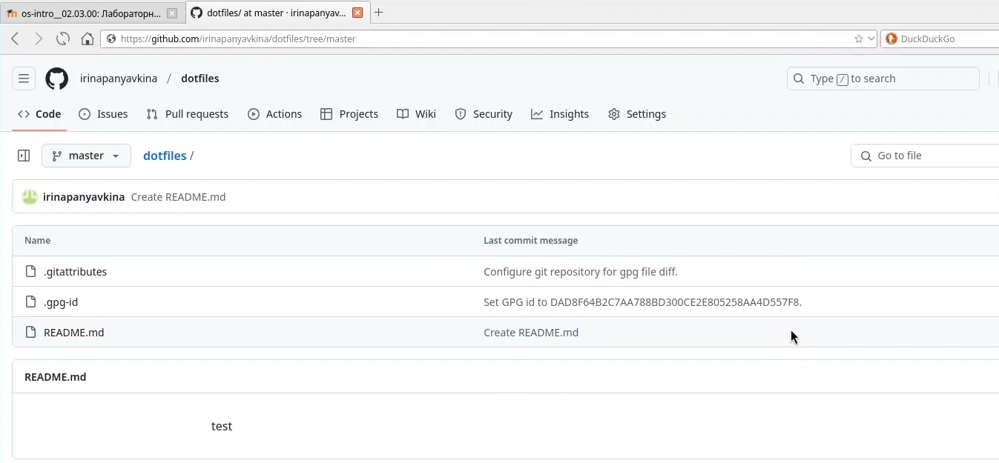{#fig:001 width=70%}

## Выполнение лабораторной работы. Менеджер паролей pass
Сначала устанавливаю необходимое программное обеспечение: pass-otp и gopass (рис.2).

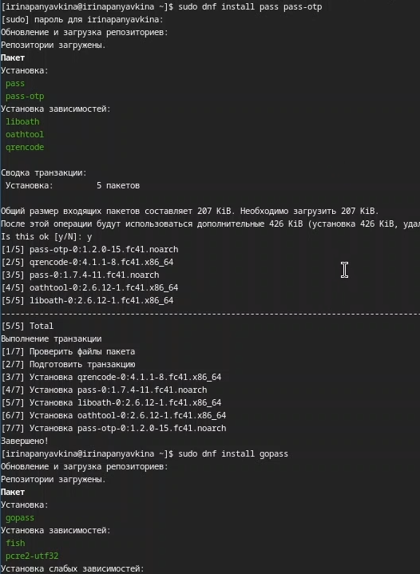{#fig:002 width=70%}

## Выполнение лабораторной работы. Настройка
Вывожу список gpg-ключей (рис.3).

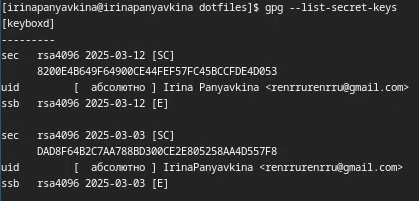{#fig:003 width=70%}

## Выполнение лабораторной работы. Настройка
Затем инициализирую хранилище (рис.4).

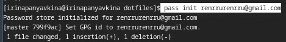{#fig:004 width=70%}

## Выполнение лабораторной работы. Настройка
Создаю структуру git (рис.5).

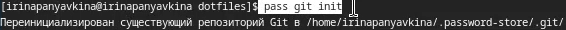{#fig:005 width=70%}

## Выполнение лабораторной работы. Настройка
Пробую сделать изменения непосредственно на файловой системе, вручную закоммитить и выложить изменения. Для этого перехожу в папку .password-store, ввожу git add и git commit (рис.6).

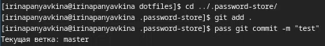{#fig:006 width=70%}

## Выполнение лабораторной работы. Настройка
Чтобы присутствовали изменения, создаю README.md (рис.7).

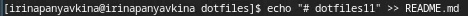{#fig:007 width=70%}

## Выполнение лабораторной работы. Настройка
Проверяю статус ветки через git status (рис.8).

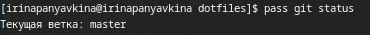{#fig:008 width=70%}

## Выполнение лабораторной работы. Настройка
Отправляю изменения через git pull (рис.9).

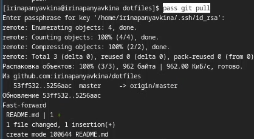{#fig:009 width=70%}

## Выполнение лабораторной работы. Сохранение пароля
Добавляю новый пароль (рис.10).

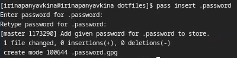{#fig:010 width=70%}

## Выполнение лабораторной работы. Сохранение пароля
Заменяю существующий пароль (рис.11).

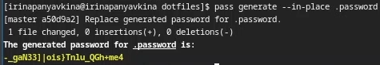{#fig:011 width=70%}

## Выполнение лабораторной работы. Управление файлами конфигурации. Дополнительное программное обеспечение
Устанавливаю дополнительное программное обеспечение (рис.12).

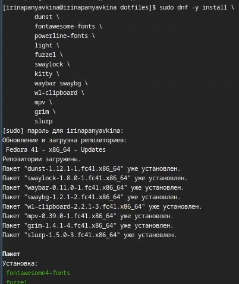{#fig:012 width=70%}

## Выполнение лабораторной работы. Управление файлами конфигурации. Дополнительное программное обеспечение
Устанавливаю шрифты в три команды, ввожу первую команду (рис.13).

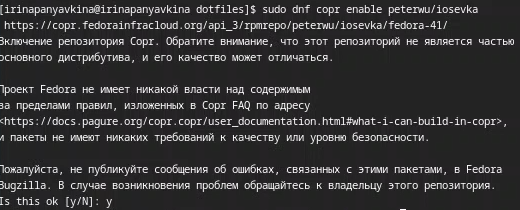{#fig:013 width=70%}

## Выполнение лабораторной работы. Управление файлами конфигурации. Дополнительное программное обеспечение
Ввожу вторую команду (рис.14).

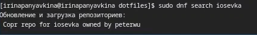{#fig:014 width=70%}

## Выполнение лабораторной работы. Управление файлами конфигурации. Дополнительное программное обеспечение
Ввожу третью команду (рис.15).

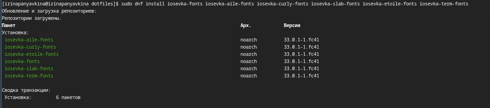{#fig:015 width=70%}

## Выполнение лабораторной работы. Управление файлами конфигурации. Дополнительное программное обеспечение
Устанавливаю бинарный файл. Скрипт определяет архитектуру процессора и операционную систему и скачивает необходимый файл (рис.16).

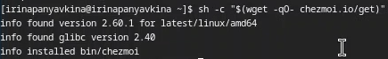{#fig:016 width=70%}

## Выполнение лабораторной работы. Подключение репозитория к своей системе
Так как репозиторий dotfiles у меня уже создан, то я просто клонирую в него шаблон (рис.17).

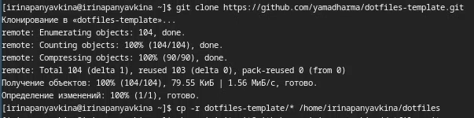{#fig:017 width=70%}

## Выполнение лабораторной работы. Подключение репозитория к своей системе
Инициализирую chezmoi с своим репозиторием dotfiles  (рис.18).

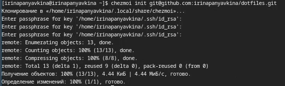{#fig:018 width=70%}

## Выполнение лабораторной работы. Ежедневные операции с Chezmoi
Проверяю через chezmoi diff, какие изменения внесёт chezmoi в домашний каталог. Меня устраивают изменения, внесённые chezmoi, запускаю chezmoi apply -v. Через chezmoi update -v при существующем каталоге chezmoi можно получить и применить последние изменения из вашего репозитория, а через chezmoi git pull -- --autostash --rebase && chezmoi diff запускается git pull --autostash --rebase в моем исходном каталоге, а chezmoi diff затем показывает разницу между целевым состоянием, вычисленным из вашего исходного каталога, и фактическим состоянием, но так как все изменения уже применены и новых нет, то система пишет "Уже актуально" (рис.19).

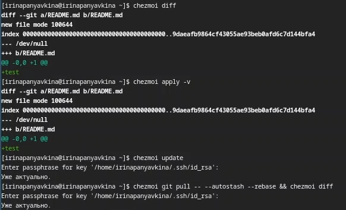{#fig:019 width=70%}

## Выполнение лабораторной работы. Ежедневные операции с Chezmoi
Для того, чтобы автоматически фиксировать и отправлять изменения в репозиторий, включаю функцию, добавив в файл конфигурации ~/.config/chezmoi/chezmoi.toml следующее: autoCommit = true и autoPush = true (рис.20).

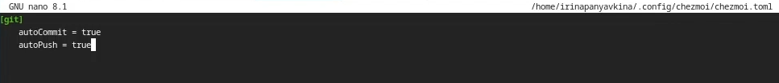{#fig:020 width=70%}

# Выводы

В ходе выполнения лабораторной работы, я установила менеджер паролей pass, успешно его настроила, а также приобрела навыки пользования данной программой.

# Список литературы{.unnumbered}

1. Лабораторная работа №5 [Электронный ресурс] URL: https://esystem.rudn.ru/mod/page/view.php?id=1224377
