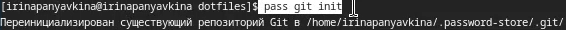

---
## Front matter
title: "Отчет по лабораторной работе №5"
subtitle: "Операционные системы"
author: "Ирина Васильевна Панявкина"

## Generic otions
lang: ru-RU
toc-title: "Содержание"

## Bibliography
bibliography: bib/cite.bib
csl: pandoc/csl/gost-r-7-0-5-2008-numeric.csl

## Pdf output format
toc: true # Table of contents
toc-depth: 2
lof: true # List of figures
lot: true # List of tables
fontsize: 12pt
linestretch: 1.5
papersize: a4
documentclass: scrreprt
## I18n polyglossia
polyglossia-lang:
  name: russian
  options:
	- spelling=modern
	- babelshorthands=true
polyglossia-otherlangs:
  name: english
## I18n babel
babel-lang: russian
babel-otherlangs: english
## Fonts
mainfont: IBM Plex Serif
romanfont: IBM Plex Serif
sansfont: IBM Plex Sans
monofont: IBM Plex Mono
mathfont: STIX Two Math
mainfontoptions: Ligatures=Common,Ligatures=TeX,Scale=0.94
romanfontoptions: Ligatures=Common,Ligatures=TeX,Scale=0.94
sansfontoptions: Ligatures=Common,Ligatures=TeX,Scale=MatchLowercase,Scale=0.94
monofontoptions: Scale=MatchLowercase,Scale=0.94,FakeStretch=0.9
mathfontoptions:
## Biblatex
biblatex: true
biblio-style: "gost-numeric"
biblatexoptions:
  - parentracker=true
  - backend=biber
  - hyperref=auto
  - language=auto
  - autolang=other*
  - citestyle=gost-numeric
## Pandoc-crossref LaTeX customization
figureTitle: "Рис."
tableTitle: "Таблица"
listingTitle: "Листинг"
lofTitle: "Список иллюстраций"
lotTitle: "Список таблиц"
lolTitle: "Листинги"
## Misc options
indent: true
header-includes:
  - \usepackage{indentfirst}
  - \usepackage{float} # keep figures where there are in the text
  - \floatplacement{figure}{H} # keep figures where there are in the text
---

# Цель работы

Установка менеджера паролей pass, его настройка, а также приобретение навыков пользования данной программой.

# Задание

1. Установка и настройка менеджера паролей
2. Управление файлами конфигурации
3. Установка дополнительного программного обеспечения

# Теоретическое введение

Менеджер паролей pass — программа, сделанная в рамках идеологии Unix.
Также носит название стандартного менеджера паролей для Unix (The standard Unix password manager). Основными свойствами являются хранение данных в файловой системе в виде каталогов и файлов и шифровка файлов с помощью GPG-ключа. Структура базы паролей может быть произвольной, если Вы собираетесь использовать её напрямую, без промежуточного программного обеспечения. Тогда семантику структуры базы данных Вы держите в своей голове. Если же необходимо использовать дополнительное программное обеспечение, необходимо семантику заложить в структуру базы паролей.

# Выполнение лабораторной работы

## Менеджер паролей pass

Перед выполнением лабораторной работы создаю репозиторий dotfiles (рис. [-@fig:001]).

{#fig:001 width=70%}

Сначала устанавливаю необходимое программное обеспечение: pass-otp и gopass (рис. [-@fig:002]).

{#fig:002 width=70%}

## Настройка

Вывожу список gpg-ключей (рис. [-@fig:003]).

{#fig:003 width=70%}

Затем инициализирую хранилище (рис. [-@fig:004]).

{#fig:004 width=70%}

Создаю структуру git (рис. [-@fig:005]).

{#fig:005 width=70%}

Пробую сделать изменения непосредственно на файловой системе, вручную закоммитить и выложить изменения. Для этого перехожу в папку .password-store, ввожу git add и git commit (рис. [-@fig:006]).

{#fig:006 width=70%}

Чтобы присутствовали изменения, создаю README.md (рис. [-@fig:007]).

{#fig:007 width=70%}

Проверяю статус ветки через git status (рис. [-@fig:008]).

{#fig:008 width=70%}

Отправляю изменения через git pull (рис. [-@fig:009]).

{#fig:009 width=70%}

## Сохранение пароля

Добавляю новый пароль (рис. [-@fig:010]).

{#fig:010 width=70%}

Заменяю существующий пароль (рис. [-@fig:011]).

{#fig:011 width=70%}

## Управление файлами конфигурации. Дополнительное программное обеспечение

Устанавливаю дополнительное программное обеспечение (рис. [-@fig:012]).

{#fig:012 width=70%}

Устанавливаю шрифты в три команды, ввожу первую команду (рис. [-@fig:013]).

{#fig:013 width=70%}

Ввожу вторую команду (рис. [-@fig:014]).

{#fig:014 width=70%}

Ввожу третью команду (рис. [-@fig:015]).

{#fig:015 width=70%}

Устанавливаю бинарный файл. Скрипт определяет архитектуру процессора и операционную систему и скачивает необходимый файл (рис. [-@fig:016]).

{#fig:016 width=70%}

## Подключение репозитория к своей системе

Так как репозиторий dotfiles у меня уже создан, то я просто клонирую в него шаблон (рис. [-@fig:017]).

{#fig:017 width=70%}

Инициализирую chezmoi с своим репозиторием dotfiles  (рис. [-@fig:018]).

{#fig:018 width=70%}

## Ежедневные операции с Chezmoi
Проверяю через chezmoi diff, какие изменения внесёт chezmoi в домашний каталог. Меня устраивают изменения, внесённые chezmoi, запускаю chezmoi apply -v. Через chezmoi update -v при существующем каталоге chezmoi можно получить и применить последние изменения из вашего репозитория, а через chezmoi git pull -- --autostash --rebase && chezmoi diff запускается git pull --autostash --rebase в моем исходном каталоге, а chezmoi diff затем показывает разницу между целевым состоянием, вычисленным из вашего исходного каталога, и фактическим состоянием, но так как все изменения уже применены и новых нет, то система пишет "Уже актуально" (рис. [-@fig:019]).

{#fig:019 width=70%}

Для того, чтобы автоматически фиксировать и отправлять изменения в репозиторий, включаю функцию, добавив в файл конфигурации ~/.config/chezmoi/chezmoi.toml следующее: autoCommit = true и autoPush = true (рис. [-@fig:020]).

{#fig:020 width=70%}

# Выводы

В ходе выполнения лабораторной работы, я установила менеджер паролей pass, успешно его настроила, а также приобрела навыки пользования данной программой.

# Список литературы{.unnumbered}

1. Лабораторная работа №5 [Электронный ресурс] URL: https://esystem.rudn.ru/mod/page/view.php?id=1224377
