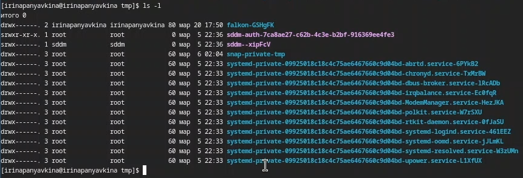
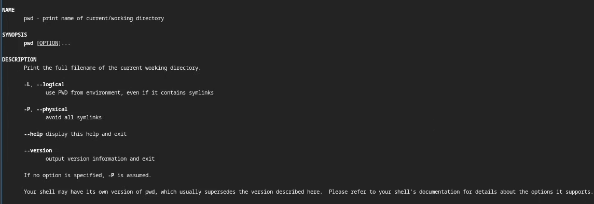
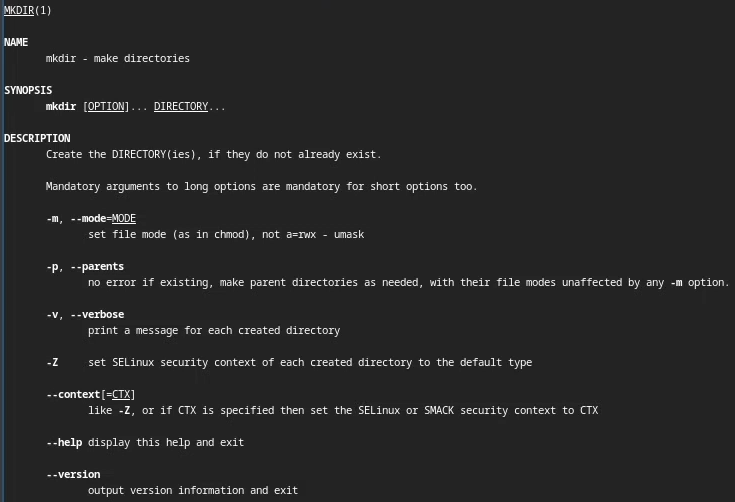
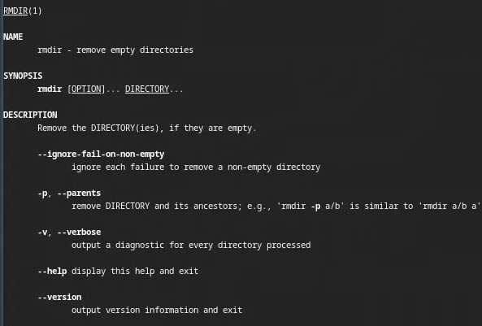
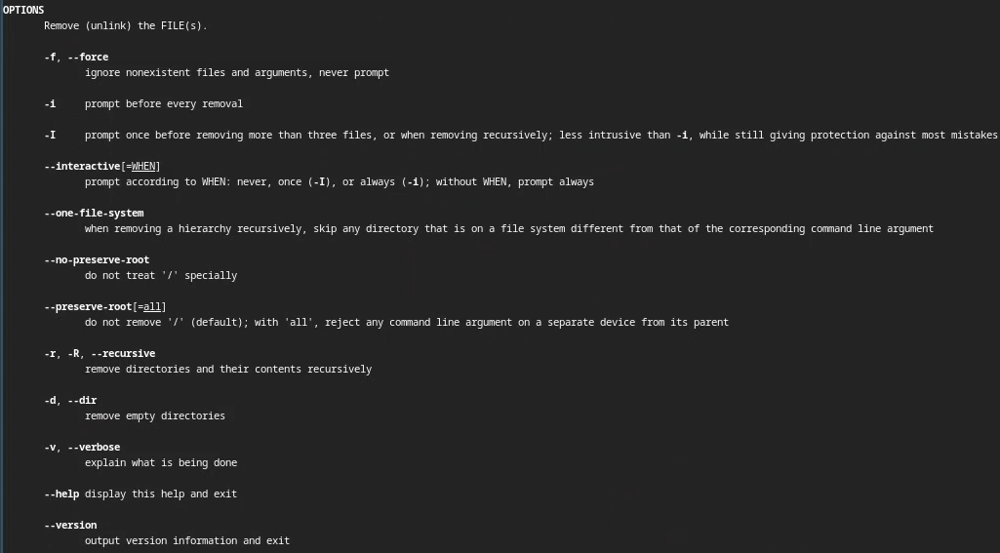
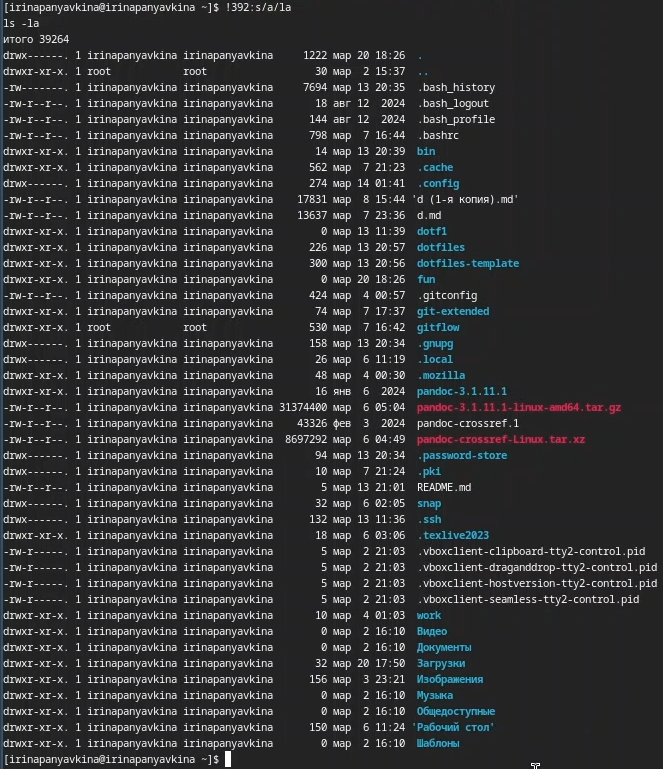

---
## Front matter
lang: ru-RU
title: Лабораторная работа №6
subtitle: Операционные системы
author:
  - Панявкина И.В.
institute:
  - Российский университет дружбы народов, Москва, Россия
date: 20 марта 2025

## i18n babel
babel-lang: russian
babel-otherlangs: english

## Formatting pdf
toc: false
toc-title: Содержание
slide_level: 2
aspectratio: 169
section-titles: true
theme: metropolis
header-includes:
 - \metroset{progressbar=frametitle,sectionpage=progressbar,numbering=fraction}
---

## Цель работы

  Приобретение практических навыков взаимодействия пользователя с системой по-
средством командной строки.

## Задание

1. Определите полное имя вашего домашнего каталога. Далее относительно этого ката-
лога будут выполняться последующие упражнения.
2. Выполните следующие действия:
- 2.1. Перейдите в каталог /tmp.
- 2.2. Выведите на экран содержимое каталога /tmp. Для этого используйте команду ls
с различными опциями. Поясните разницу в выводимой на экран информации.
- 2.3. Определите, есть ли в каталоге /var/spool подкаталог с именем cron?
- 2.4. Перейдите в Ваш домашний каталог и выведите на экран его содержимое. Опре-
делите, кто является владельцем файлов и подкаталогов?

## Задание

3. Выполните следующие действия:
- 3.1. В домашнем каталоге создайте новый каталог с именем newdir.
- 3.2. В каталоге ~/newdir создайте новый каталог с именем morefun.
- 3.3. В домашнем каталоге создайте одной командой три новых каталога с именами
letters, memos, misk. Затем удалите эти каталоги одной командой.
- 3.4. Попробуйте удалить ранее созданный каталог ~/newdir командой rm. Проверьте,
был ли каталог удалён.
- 3.5. Удалите каталог ~/newdir/morefun из домашнего каталога. Проверьте, был ли
каталог удалён.

## Задание

4. С помощью команды man определите, какую опцию команды ls нужно использо-
вать для просмотра содержимое не только указанного каталога, но и подкаталогов,
входящих в него.
5. С помощью команды man определите набор опций команды ls, позволяющий отсорти-
ровать по времени последнего изменения выводимый список содержимого каталога
с развёрнутым описанием файлов.
6. Используйте команду man для просмотра описания следующих команд: cd, pwd, mkdir,
rmdir, rm. Поясните основные опции этих команд.
7. Используя информацию, полученную при помощи команды history, выполните мо-
дификацию и исполнение нескольких команд из буфера команд.

## Теоретическое введение
  В операционной системе типа Linux взаимодействие пользователя с системой обычно
осуществляется с помощью командной строки посредством построчного ввода команд. При этом обычно используется командные интерпретаторы языка shell: /bin/sh;
/bin/csh; /bin/ksh.
  Командой в операционной системе называется записанный по
специальным правилам текст (возможно с аргументами), представляющий собой указание на выполнение какой-либо функций (или действий) в операционной системе.
Обычно первым словом идёт имя команды, остальной текст — аргументы или опции,
конкретизирующие действие.

## Теоретическое введение
  Общий формат команд можно представить следующим образом:
<имя_команды><разделитель><аргументы>
Команда man. Команда man используется для просмотра (оперативная помощь) в диалоговом режиме руководства (manual) по основным командам операционной системы
типа Linux.
  Формат команды:
man <команда>

## Теоретическое введение
  Файловая система ОС типа Linux — иерархическая система каталогов,
подкаталогов и файлов, которые обычно организованы и сгруппированы по функциональному признаку. Самый верхний каталог в иерархии называется корневым
и обозначается символом /. Корневой каталог содержит системные файлы и другие
каталоги.
  В работе с командами, в качестве аргументов которых
выступает путь к какому-либо каталогу или файлу, можно использовать сокращённую
запись пути.

## Выполнение лабораторной работы
  Полное имя домашнего каталога я узнаю с помощью утилиты pwd (рис.1).

{#fig:001 width=70%}

## Выполнение лабораторной работы
  С помощью утилиты cd перехожу в подкаталог tmp корневого каталога (рис.2).

{#fig:002 width=70%}

## Выполнение лабораторной работы
  Утилитой ls просматриваю содержимое каталога tmp (рис.3).

{#fig:003 width=70%}

## Выполнение лабораторной работы
  Пробую использовать команду ls с разными опциями. Опция -l позволяет увидеть дополнительную информацию о файлах в каталоге: время создания, владельца, права (рис.4).

{#fig:004 width=70%}

## Выполнение лабораторной работы
  Опция -a показывает скрытые файлы в каталоге (рис.5).

{#fig:005 width=70%}

## Выполнение лабораторной работы
  Перехожу в каталог /var/spool/ с помощью cd.
  Чтобы определить, есть ли в каталоге подкатлог с соответствющим именем воспользуемся утилитой ls с флагом -F, чтобы проверить, что мы найдем именно каталог.
  В директории действительно есть такой каталог cron (рис.6).

{#fig:006 width=70%}

## Выполнение лабораторной работы
  Возвращаюсь в домашний каталог командой cd. Затем проверяю содержимое каталога с помощью утилиты ls
  1. опция -l позволяет определить владельцев файлов,
  2. опция -a показывает все содержимое каталога,
  3. -F поможет определить что из содержимого каталога файл, а что каталог (рис.7).
  
## Выполнение лабораторной работы

{#fig:007 width=70%}

## Выполнение лабораторной работы
  Создаю директорию newdir с помощью утилиты mkdir (рис.8).

{#fig:008 width=70%}

## Выполнение лабораторной работы
  Создаю для каталога newdir подкаталог morefun, проверяю, что каталог создан с помощью ls (рис.9).

{#fig:009 width=70%}

## Выполнение лабораторной работы
  Для создания несколькольких директорий одной строчкой нужно перечислить названия директорий через пробел после утилиты mkdir. Проверяю создание всех файлов  (рис.10).

{#fig:010 width=70%}

## Выполнение лабораторной работы
  Чтобы удалить несколько **пустых** директорий одной строчкой нужно перечислить названия директорий через пробел после утилиты rmdir. Проверяю, что все файлы удалены  (рис.11).

{#fig:011 width=70%}

## Выполнение лабораторной работы
  Удаляю директорию newdir с помощью утилиты rmdir, т.к директория не пустая, я добавляю флаг удалить рекурсивно -p, чтобы удалилсь и все подкаталоги (рис.12).

{#fig:012 width=70%}

## Выполнение лабораторной работы
  С помощью команды man ls я могу прочесть документацию к команде ls, опция, которая выводит все подкаталоги каталогов представлена на скриншоте, это -R (рис.13).

{#fig:013 width=70%}

## Выполнение лабораторной работы
  Так как мне нужно найти опцию утилиты ls для сортировки, то можно сузить поиск до результатов с таким вопросом. Для сортировки и вывода информации нужна комбинация опций -lt  (рис.14)

{#fig:014 width=70%}

## Выполнение лабораторной работы
  С помощью man cd узнаю описание команды cd и ее опции. Основные опции:(рис.15)
1. -P - позволяет следовать по символическим ссылкам перед тем, как обработаны все переходы '..'
2. -L - переходит по символическим ссылкам только после того, как обработаны все переходы ".."
3. -e - позволяет выйти с ошибкой, если диреткория, в которую нужно перейти, не найдена.

{#fig:015 width=70%}

## Выполнение лабораторной работы
  С помощью man pwd узнаю описание команды pwd и ее опции (рис.16).
1. -L - брать директорию из переменной окружения, даже если она содержит символические ссылки.
2. -P - отбрасывать все символические ссылки.

{#fig:016 width=70%}

## Выполнение лабораторной работы
  С помощью man mkdir узнаю описание команды mkdir и ее опции (рис.17).
1. -m - устанавливает права доступа создаваемой директории как chmod, синтаксис тоже как у chmod.
2. -p - позволяет рекурсивно создавать директории и их подкаталоги
3. -v - выводи сообщение о созданных директориях
4. -z - установить контекст SELinux для создаваемой директории по умолчанию
5. -context - установить контекст SELinux для создаваемой директории в значении CTX

## Выполнение лабораторной работы
{#fig:017 width=70%}

## Выполнение лабораторной работы
  С помощью man rmdir узнаю описание команды rmdir и ее опции (рис.18).
1. --ignore-fail-on-non-empty - отменяет вывод ошибки, если каталог не пустой, просто его игнорирует
2. -p - удаляет рекурсивно каталоги, если они все содержат в себе только удаляемый каталог
3. -v - выводит сообщение о каждом удалении  директории.

## Выполнение лабораторной работы
{#fig:018 width=70%}

## Выполнение лабораторной работы
  С помощью man rm узнаю описание команды rm и ее опции (рис.19).
1. -f - игнорировать несуществующие файлы или аргументы, никогда не выводить запрос на подтверждение удаления
2. -i - выводить запрос на подтверждение удаления каждого файла
3. -I - вывести запрос на подтверждение удаления один раз, для всех файлов, если удаляется больше 3-х файлов или идет рекурсивное удаление
4. --interactive - заменяет предыдущие три опции, можно выбрать одну из них.
5. --one-file-system - во время рекурсивного удаления пропускать директории из других файловых систем
6. --no-preserve-root если в качестве директории задана корневая, то считать что это обычная директория и начать удаление.
7. -r, -R - удаляет директории их содержимое рекурсивно
8. -d, --dir - удаляет пустые директории
9. -v - прописывает все действия команды

## Выполнение лабораторной работы
{#fig:019 width=70%}

  Опции --help --version применимы почти ко всем утилитам, они показывают справку по команде и ее версию соответственно.

## Выполнение лабораторной работы
  Вывела историю команд с помощью утилиты history (рис.20).

{#fig:020 width=70%}

## Выполнение лабораторной работы
  Модифицировала команду (рис.21).

{#fig:021 width=70%}

## Выполнение лабораторной работы
  Модифицировала команду (рис.22).

{#fig:022 width=70%}

## Выводы

  Я приобрела практические навыки взаимодействия пользователя с системой посредством командной строки.

# Список литературы{.unnumbered}

1. Лабораторная работа №6 [Электронный ресурс] URL: https://esystem.rudn.ru/mod/resource/view.php?id=1224379
