---
## Front matter
title: "Отчёт по лабораторной работе №6"
subtitle: "Операционные системы"
author: "Ирина Васильевна Панявкина"

## Generic otions
lang: ru-RU
toc-title: "Содержание"

## Bibliography
bibliography: bib/cite.bib
csl: pandoc/csl/gost-r-7-0-5-2008-numeric.csl

## Pdf output format
toc: true # Table of contents
toc-depth: 2
lof: true # List of figures
lot: true # List of tables
fontsize: 12pt
linestretch: 1.5
papersize: a4
documentclass: scrreprt
## I18n polyglossia
polyglossia-lang:
  name: russian
  options:
	- spelling=modern
	- babelshorthands=true
polyglossia-otherlangs:
  name: english
## I18n babel
babel-lang: russian
babel-otherlangs: english
## Fonts
mainfont: IBM Plex Serif
romanfont: IBM Plex Serif
sansfont: IBM Plex Sans
monofont: IBM Plex Mono
mathfont: STIX Two Math
mainfontoptions: Ligatures=Common,Ligatures=TeX,Scale=0.94
romanfontoptions: Ligatures=Common,Ligatures=TeX,Scale=0.94
sansfontoptions: Ligatures=Common,Ligatures=TeX,Scale=MatchLowercase,Scale=0.94
monofontoptions: Scale=MatchLowercase,Scale=0.94,FakeStretch=0.9
mathfontoptions:
## Biblatex
biblatex: true
biblio-style: "gost-numeric"
biblatexoptions:
  - parentracker=true
  - backend=biber
  - hyperref=auto
  - language=auto
  - autolang=other*
  - citestyle=gost-numeric
## Pandoc-crossref LaTeX customization
figureTitle: "Рис."
tableTitle: "Таблица"
listingTitle: "Листинг"
lofTitle: "Список иллюстраций"
lotTitle: "Список таблиц"
lolTitle: "Листинги"
## Misc options
indent: true
header-includes:
  - \usepackage{indentfirst}
  - \usepackage{float} # keep figures where there are in the text
  - \floatplacement{figure}{H} # keep figures where there are in the text
---

# Цель работы

  Приобретение практических навыков взаимодействия пользователя с системой по-
средством командной строки.

# Задание

1. Определите полное имя вашего домашнего каталога. Далее относительно этого ката-
лога будут выполняться последующие упражнения.
2. Выполните следующие действия:
- 2.1. Перейдите в каталог /tmp.
- 2.2. Выведите на экран содержимое каталога /tmp. Для этого используйте команду ls
с различными опциями. Поясните разницу в выводимой на экран информации.
- 2.3. Определите, есть ли в каталоге /var/spool подкаталог с именем cron?
- 2.4. Перейдите в Ваш домашний каталог и выведите на экран его содержимое. Опре-
делите, кто является владельцем файлов и подкаталогов?
3. Выполните следующие действия:
- 3.1. В домашнем каталоге создайте новый каталог с именем newdir.
- 3.2. В каталоге ~/newdir создайте новый каталог с именем morefun.
- 3.3. В домашнем каталоге создайте одной командой три новых каталога с именами
letters, memos, misk. Затем удалите эти каталоги одной командой.
- 3.4. Попробуйте удалить ранее созданный каталог ~/newdir командой rm. Проверьте,
был ли каталог удалён.
- 3.5. Удалите каталог ~/newdir/morefun из домашнего каталога. Проверьте, был ли
каталог удалён.
4. С помощью команды man определите, какую опцию команды ls нужно использо-
вать для просмотра содержимое не только указанного каталога, но и подкаталогов,
входящих в него.
5. С помощью команды man определите набор опций команды ls, позволяющий отсорти-
ровать по времени последнего изменения выводимый список содержимого каталога
с развёрнутым описанием файлов.
6. Используйте команду man для просмотра описания следующих команд: cd, pwd, mkdir,
rmdir, rm. Поясните основные опции этих команд.
7. Используя информацию, полученную при помощи команды history, выполните мо-
дификацию и исполнение нескольких команд из буфера команд.

# Теоретическое введение

  В операционной системе типа Linux взаимодействие пользователя с системой обычно
осуществляется с помощью командной строки посредством построчного ввода команд. При этом обычно используется командные интерпретаторы языка shell: /bin/sh;
/bin/csh; /bin/ksh.
  Командой в операционной системе называется записанный по
специальным правилам текст (возможно с аргументами), представляющий собой указание на выполнение какой-либо функций (или действий) в операционной системе.
Обычно первым словом идёт имя команды, остальной текст — аргументы или опции,
конкретизирующие действие.
  Общий формат команд можно представить следующим образом:
<имя_команды><разделитель><аргументы>
Команда man. Команда man используется для просмотра (оперативная помощь) в диалоговом режиме руководства (manual) по основным командам операционной системы
типа Linux.
  Формат команды:
man <команда>
  Файловая система ОС типа Linux — иерархическая система каталогов,
подкаталогов и файлов, которые обычно организованы и сгруппированы по функциональному признаку. Самый верхний каталог в иерархии называется корневым
и обозначается символом /. Корневой каталог содержит системные файлы и другие
каталоги.
  В работе с командами, в качестве аргументов которых
выступает путь к какому-либо каталогу или файлу, можно использовать сокращённую
запись пути.

# Выполнение лабораторной работы

  Полное имя домашнего каталога я узнаю с помощью утилиты pwd (рис. [-@fig:001]).

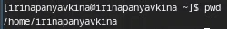{#fig:001 width=70%}

  С помощью утилиты cd перехожу в подкаталог tmp корневого каталога (рис. [-@fig:002]).

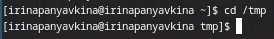{#fig:002 width=70%}

  Утилитой ls просматриваю содержимое каталога tmp (рис. [-@fig:003]).

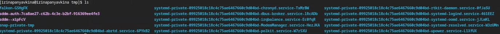{#fig:003 width=70%}

  Пробую использовать команду ls с разными опциями. Опция -l позволяет увидеть дополнительную информацию о файлах в каталоге: время создания, владельца, права (рис. [-@fig:004]).

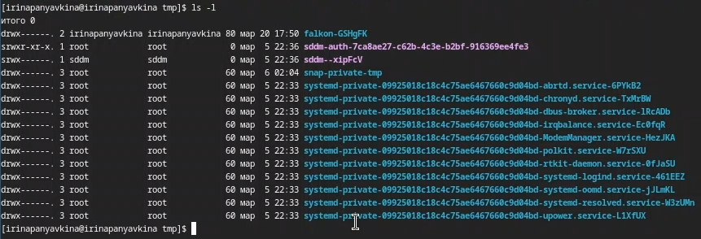{#fig:004 width=70%}

  Опция -a показывает скрытые файлы в каталоге (рис. [-@fig:005]).

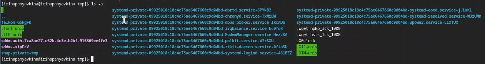{#fig:005 width=70%}

  Перехожу в каталог /var/spool/ с помощью cd. Чтобы определить, есть ли в каталоге подкатлог с соответствющим именем воспользуемся утилитой ls с флагом -F, чтобы проверить, что мы найдем именно каталог. В директории действительно есть такой каталог cron (рис. [-@fig:006]).

{#fig:006 width=70%}

  Возвращаюсь в домашний каталог командой cd. Затем проверяю содержимое каталога с помощью утилиты ls, опция -l позволяет определить владельцев файлов, опция -a показывает все содержимое каталога, -F поможет определить что из содержимого каталога файл, а что каталог (рис. [-@fig:007]).

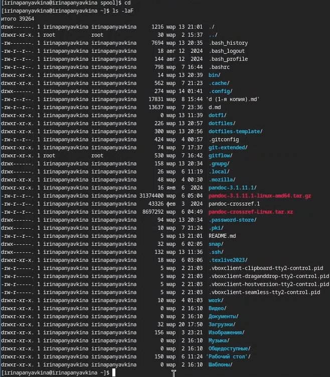{#fig:007 width=70%}

  Создаю директорию newdir с помощью утилиты mkdir (рис. [-@fig:008]).

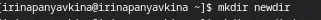{#fig:008 width=70%}

  Создаю для каталога newdir подкаталог morefun, проверяю, что каталог создан с помощью ls (рис. [-@fig:009]).

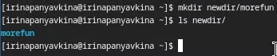{#fig:009 width=70%}

  Для создания несколькольких директорий одной строчкой нужно перечислить названия директорий через пробел после утилиты mkdir. Проверяю создание всех файлов  (рис. [-@fig:010]).

{#fig:010 width=70%}

  Чтобы удалить несколько **пустых** директорий одной строчкой нужно перечислить названия директорий через пробел после утилиты rmdir. Проверяю, что все файлы удалены  (рис. [-@fig:011]).

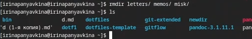{#fig:011 width=70%}

  Удаляю директорию newdir с помощью утилиты rmdir, т.к директория не пустая, я добавляю флаг удалить рекурсивно -p, чтобы удалилсь и все подкаталоги (рис. [-@fig:012]).

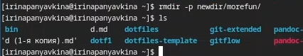{#fig:012 width=70%}

  С помощью команды man ls я могу прочесть документацию к команде ls, опция, которая выводит все подкаталоги каталогов представлена на скриншоте, это -R (рис. [-@fig:013]).

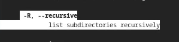{#fig:013 width=70%}

  Так как мне нужно найти опцию утилиты ls для сортировки, то можно сузить поиск до результатов с таким вопросом. Для сортировки и вывода информации нужна комбинация опций -lt  (рис. [-@fig:014])

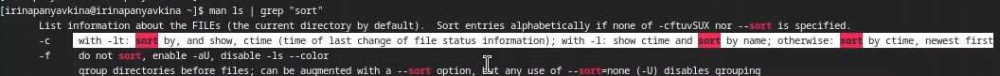{#fig:014 width=70%}

  С помощью man cd узнаю описание команды cd и ее опции. Основные опции:(рис. [-@fig:015])
1. -P - позволяет следовать по символическим ссылкам перед тем, как обработаны все переходы '..'
2. -L - переходит по символическим ссылкам только после того, как обработаны все переходы ".."
3. -e - позволяет выйти с ошибкой, если диреткория, в которую нужно перейти, не найдена.

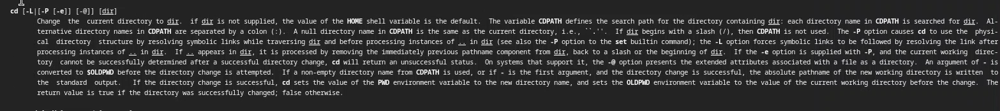{#fig:015 width=70%}

  С помощью man pwd узнаю описание команды pwd и ее опции (рис. [-@fig:016]).
1. -L - брать директорию из переменной окружения, даже если она содержит символические ссылки.
2. -P - отбрасывать все символические ссылки.

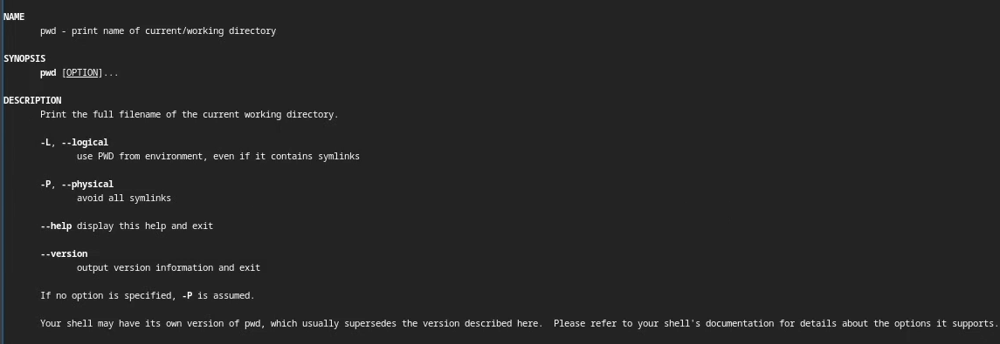{#fig:016 width=70%}

  С помощью man mkdir узнаю описание команды mkdir и ее опции (рис. [-@fig:017]).
1. -m - устанавливает права доступа создаваемой директории как chmod, синтаксис тоже как у chmod.
2. -p - позволяет рекурсивно создавать директории и их подкаталоги
3. -v - выводи сообщение о созданных директориях
4. -z - установить контекст SELinux для создаваемой директории по умолчанию
5. -context - установить контекст SELinux для создаваемой директории в значении CTX

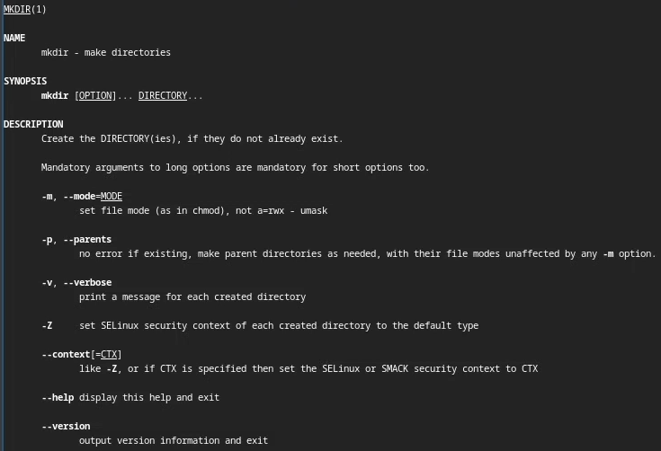{#fig:017 width=70%}

  С помощью man rmdir узнаю описание команды rmdir и ее опции (рис. [-@fig:018]).
1. --ignore-fail-on-non-empty - отменяет вывод ошибки, если каталог не пустой, просто его игнорирует
2. -p - удаляет рекурсивно каталоги, если они все содержат в себе только удаляемый каталог
3. -v - выводит сообщение о каждом удалении  директории.

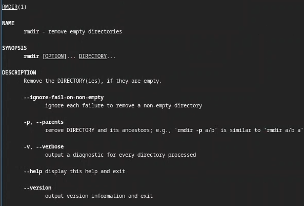{#fig:018 width=70%}

  С помощью man rm узнаю описание команды rm и ее опции (рис. [-@fig:019]).
1. -f - игнорировать несуществующие файлы или аргументы, никогда не выводить запрос на подтверждение удаления
2. -i - выводить запрос на подтверждение удаления каждого файла
3. -I - вывести запрос на подтверждение удаления один раз, для всех файлов, если удаляется больше 3-х файлов или идет рекурсивное удаление
4. --interactive - заменяет предыдущие три опции, можно выбрать одну из них.
5. --one-file-system - во время рекурсивного удаления пропускать директории из других файловых систем
6. --no-preserve-root если в качестве директории задана корневая, то считать что это обычная директория и начать удаление.
7. -r, -R - удаляет директории их содержимое рекурсивно
8. -d, --dir - удаляет пустые директории
9. -v - прописывает все действия команды

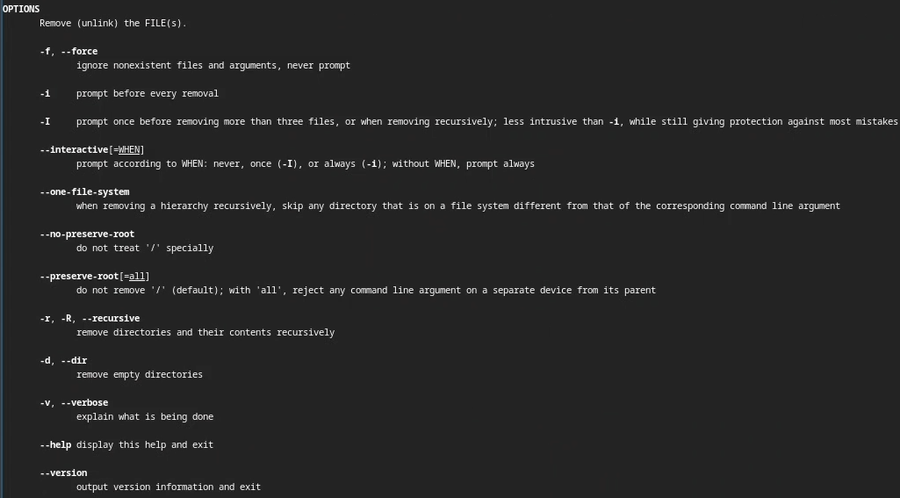{#fig:019 width=70%}

  Опции --help --version применимы почти ко всем утилитам, они показывают справку по команде и ее версию соответственно.

  Вывела историю команд с помощью утилиты history (рис. [-@fig:020]).

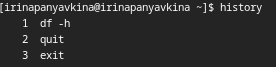{#fig:020 width=70%}

  Модифицировала команду (рис. [-@fig:021]).

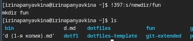{#fig:021 width=70%}

  Модифицировала команду (рис. [-@fig:022]).

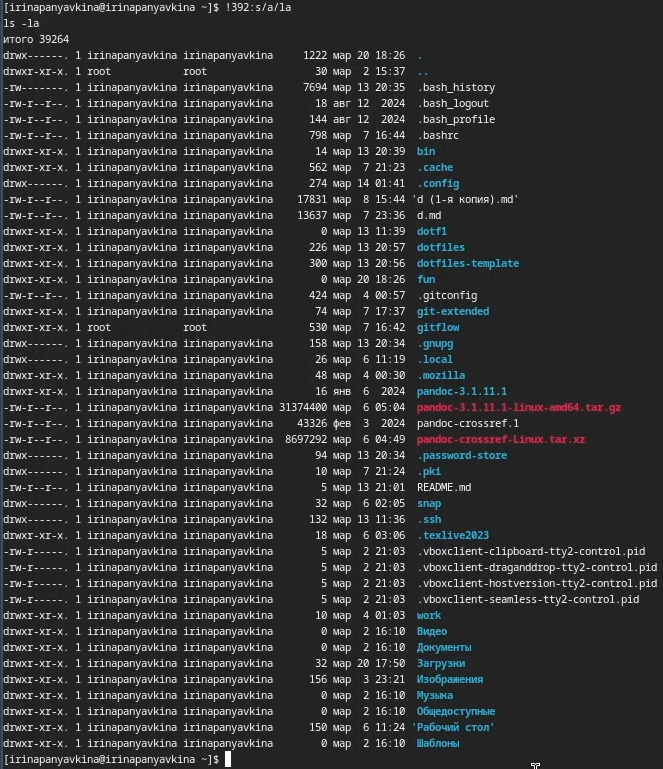{#fig:022 width=70%}

# Выводы

  Я приобрела практические навыки взаимодействия пользователя с системой посредством командной строки.

# Ответы на контрольные вопросы

1. Командная строка - это текстовая система, которая передает команды компьютеру и возвращает результаты пользователю. В операционной системе типа Linux взаимодействие пользователя с системой обычно
осуществляется с помощью командной строки посредством построчного ввода команд.
2. Для определения абсолютного пути к текущему каталогу используется команда pwd. Например: если я введу
pwd в своем домашнем каталоге то получу /home/evdvorkina
3. С помощью команды ls можно определить имена файлов, при помощи опции -F уже мы сможем определить тип файлов, если нам необходимы скрытые файлы, добавим опцию -a. Пример есть в лабораторной работе.
4. С помощью команды ls можно определить имена файлов, если нам необходимы скрытые файлы, добавим опцию -a. Пример есть в лабораторной работе.
5. rmdir по умолчанию удаляет пустые каталоги, не удаляет файлы. rm удаляет файлы, без дополнительных опций (-d, -r) не будет удалять каталоги. Удалить в одной строчке одной командой можно файл и каталог. Если файл находится в каталоге, используем рекурсивное удаление, если файл и каталог не связаны подобным образом, то добавим опцию -d, введя имена через пробел после утилиты.
6. Вывести информацию о последних выполненных пользователем команд можно с помощью history. Пример приведет в лабораторной работе.
7. Используем синтаксиси !номеркоманды в выводе history:s/что заменяем/на что заменяем Примеры приведены в лабораторной работе.
8. Предположим, я нахожусь не в домашнем каталоге. Если я введу "cd ; ls", то окажусь в домашнем каталоге и получу вывод файлов внутри него.
9. Символ экранирования - (обратный слеш) добавление перед спецсимволом обратный слеш, чтобы использовать специальный символ как обычный. Также позволяет читать системе название директорий с пробелом. Пример: cd work/Операционные\ системы/
10. Опция -l позволит увидеть дополнительную информацию о файлах в каталоге: время создания, владельца, права доступа
11. Относительный путь к файлу начинается из той директории, где вы находитесь (она сама не прописывается в пути), он прописывается относительно данной директории. Абсолютный путь начинается с корневого каталога.
12. Использовать man <имя команды> или <имя команды> --help
13. Клавиша Tab.

# Список литературы{.unnumbered}

1. Лабораторная работа №6 [Электронный ресурс] URL: https://esystem.rudn.ru/mod/resource/view.php?id=1224379
