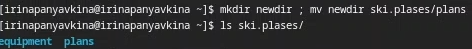

---
## Front matter
lang: ru-RU
title: Лабораторная работа №7
subtitle: Операционные системы
author:
  - Панявкина И.В
institute:
  - Российский университет дружбы народов, Москва, Россия

date: 27 марта 2025

## i18n babel
babel-lang: russian
babel-otherlangs: english

## Formatting pdf
toc: false
toc-title: Содержание
slide_level: 2
aspectratio: 169
section-titles: true
theme: metropolis
header-includes:
 - \metroset{progressbar=frametitle,sectionpage=progressbar,numbering=fraction}
---

## Цель работы

  Целью данной лабораторной работы является ознакомление с файловой системой Linux, её структурой, именами и содержанием каталогов. Приобретение практических навыков по применению команд для работы с файлами и каталогами, по управлению процессами (и работами), по проверке использования диска и обслуживанию файловой системы.

## Задание

1. Выполнить все примеры из лабораторной работы
2. Выполнить команды по копированию, созданию и перемещению файлов и каталогов
3. Определить опции команды chmod
4. Изменить права доступа к файлам
5. Прочитать документацию о командах mount, fsck, mkfs, kill

## Теоретическое введение
  Для создания текстового файла можно использовать команду touch. Для просмотра файлов небольшого размера можно использовать команду cat. Для просмотра файлов постранично удобнее использовать команду less. Команда cp используется для копирования файлов и каталогов. Команды mv и mvdir предназначены для перемещения и переименования файлов и каталогов.
  
  Каждый файл или каталог имеет права доступа.
В сведениях о файле или каталоге указываются:
– тип файла (символ (-) обозначает файл, а символ (d) — каталог);
– права для владельца файла (r — разрешено чтение, w — разрешена запись, x — разрешено выполнение, - — право доступа отсутствует);
– права для членов группы (r — разрешено чтение, w — разрешена запись, x — разрешено
выполнение, - — право доступа отсутствует);
– права для всех остальных (r — разрешено чтение, w — разрешена запись, x — разрешено
выполнение, - — право доступа отсутствует).

## Теоретическое введение 
  Права доступа к файлу или каталогу можно изменить, воспользовавшись командой
chmod. Сделать это может владелец файла (или каталога) или пользователь с правами
администратора.

## Теоретическое введение
  Файловая система в Linux состоит из фалов и каталогов. Каждому физическому носителю соответствует своя файловая система.
Существует несколько типов файловых систем. Перечислим наиболее часто встречающиеся типы:

– ext2fs (second extended filesystem);

– ext2fs (third extended file system);

– ext4 (fourth extended file system);

– ReiserFS;

– xfs;

– fat (file allocation table);

– ntfs (new technology file system).

## Теоретическое введение
  Для просмотра используемых в операционной системе файловых систем можно вос-
пользоваться командой mount без параметров.

## Выполнение лабораторной работы
  Создаю файл, дважды копирую его с новыми именами и проверяю, чтобы все команды были выполнены корректно (рис. 1).

{#fig:001 width=70%}

## Выполнение лабораторной работы
  Создаю директорию, копирую в нее два файла, созданных на прошлом этапе, проверяю, чтобы все скопировалось (рис. 2).

{#fig:002 width=70%}

## Выполнение лабораторной работы
  Копирую файл, находящийся не в текущей директории в файл с новым именем тоже не текущей директории (рис. 3).

{#fig:003 width=70%}

## Выполнение лабораторной работы
  Создаю новую директорию. Копирую предыдущую созданную директорию вместе со всем содержимым в каталог /tmp. Затем копирую предыдущую созданную директорию в новую созданную (рис. 4).

{#fig:004 width=70%}

## Выполнение лабораторной работы
  Переименовываю файл, затем перемещаю его в каталог (рис. 5).

{#fig:005 width=70%}

## Выполнение лабораторной работы
  Cоздаю новую директорию, переименовываю monthly.00 в monthly.01, перемещаю директорию в директорию reports, переименовываю эту директорию, убираю из названия 01 (рис. 6).

{#fig:006 width=70%}

## Выполнение лабораторной работы
  Создаю пустой файл, проверяю права доступа у него, изменяю права доступа, добавляя пользователю (создателю) возможность выполнять файл  (рис. 7).

{#fig:007 width=70%}

## Выполнение лабораторной работы
  Меняю права доступа у директории: группы и остальные пользователи не смогут ее прочесть (рис. 8).

{#fig:008 width=70%}

## Выполнение лабораторной работы
  Изменяю права доступа у директории, запрещаю группам и остальным пользователям читать. Создаю новый пустой файл, даю ему права доступа: группы могут в этом файле читать и писать содержимое (рис. 9).

{#fig:009 width=70%}

## Выполнение лабораторной работы
  Проверяю файловую систему (рис. 10).

{#fig:010 width=70%}

## Выполнение лабораторной работы
  Копирую файл в домашний каталог с новым именем, создаю новую пустую директорию, перемещаю файл в эту директорию, переименовываю файл (рис. 11).

{#fig:011 width=70%}

## Выполнение лабораторной работы
  Создаю новый файл, копирую его в новую директорию, но уже сразу с новым именем. Создаю внутри этого каталога подкаталог, перемещаю файлы в подкаталог (рис. 12).

{#fig:012 width=70%}

## Выполнение лабораторной работы
  Создаю новую директорию, в этой же строчке перемещаю ее с новым именем в директорию, созданную в прошлый раз (рис. 13).

{#fig:013 width=70%}

## Выполнение лабораторной работы
  Проверяю, какие права нужно поменять и как, чтобу у новой директория были нужные по заданию права. (рис. 14).

{#fig:014 width=70%}

## Выполнение лабораторной работы
  Проверяю, какие права нужно поменять и как, чтобы у новых файлов были нужные по заданию права.  (рис. 15).

{#fig:015 width=70%}

## Выполнение лабораторной работы
  Создаю файл, добавляю в правах доступа право на исполнение и убираю право на запись для владельца, затем создаю следующий файл, ему в правах доступа добавляю право на запись для группы (рис. 16).

{#fig:016 width=70%}

## Выполнение лабораторной работы
  Читаю содержимое файла (рис. 17).

{#fig:017 width=70%}

## Выполнение лабораторной работы
  Копирую файл с новым именем, перемещаю его в ранее созданную директорию, рекурсивно ее копирую с новым именем, рекурсивно копирую в нее скопированную до этого папку (рис. 18).

{#fig:018 width=70%}

## Выполнение лабораторной работы
  Убираю право на чтение у файла для создателя, поэтому не могу его прочесть, также не могу его скопировать, потому что отказано в доступе на чтение, затем возвращаю все права (рис. 19).

{#fig:019 width=70%}

## Выполнение лабораторной работы
  Убираю у директории право на исполнение для пользователя, пытаюсь в нее войти - отказано в доступе, затем возвращаю все права (рис. 20).

{#fig:020 width=70%}

## Выполнение лабораторной работы
  Я прочитала описание каждой из четырех команд с помощью man (рис. 21).
- mount — утилита командной строки в UNIX-подобных операционных системах. Применяется для монтирования файловых систем.
- fsck (проверка файловой системы) - это утилита командной строки, которая позволяет выполнять проверки согласованности и интерактивное исправление в одной или нескольких файловых системах Linux. Он использует программы, специфичные для типа файловой системы, которую он проверяет.
- mkfs используется для создания файловой системы Linux на некотором устройстве, обычно в разделе жёсткого диска. В качестве аргумента filesys для файловой системы может выступать или название устройства
- Команда Kill посылает указанный сигнал указанному процессу. Если не указано ни одного сигнала, посылается сигнал SIGTERM. Сигнал SIGTERM завершает лишь те процессы, которые не обрабатывают его приход. Для других процессов может быть необходимым послать сигнал SIGKILL, поскольку этот сигнал перехватить невозможно.

## Выполнение лабораторной работы
{#fig:021 width=70%}

# Выводы

  При выполнении данной лабораторной работы я ознакомилась с файловой системой Linux, её структурой, именами и содержанием каталогов. Приобрела практические навыки по применению команд для работы
с файлами и каталогами, по управлению процессами (и работами), по проверке использования диска и обслуживанию файловой системы.

# Список литературы
1. Лабораторная работа №7 [Электронный ресурс] URL: https://esystem.rudn.ru/mod/resource/view.php?id=1224381
