---
## Front matter
lang: ru-RU
title: Лабораторная работа №8
subtitle: Операционные системы
author:
  - Панявкина И.В.
institute:
  - Российский университет дружбы народов, Москва, Россия
date: 03 апреля 2025

## i18n babel
babel-lang: russian
babel-otherlangs: english

## Formatting pdf
toc: false
toc-title: Содержание
slide_level: 2
aspectratio: 169
section-titles: true
theme: metropolis
header-includes:
 - \metroset{progressbar=frametitle,sectionpage=progressbar,numbering=fraction}
---

## Цель работы

  Цель данной лабораторной работы - ознакомление с инструментами поиска файлов и фильтрации текстовых данных, а также приобретение практических навыков по управлению процессами (и заданиями), по проверке использования диска и по обслуживанию файловых систем.

## Задание
1. Осуществите вход в систему, используя соответствующее имя пользователя.
2. Запишите в файл file.txt названия файлов, содержащихся в каталоге /etc. Допи-
шите в этот же файл названия файлов, содержащихся в вашем домашнем каталоге.
3. Выведите имена всех файлов из file.txt, имеющих расширение .conf, после чего
запишите их в новый текстовой файл conf.txt.
4. Определите, какие файлы в вашем домашнем каталоге имеют имена, начинавшиеся
с символа c? Предложите несколько вариантов, как это сделать.
5. Выведите на экран (по странично) имена файлов из каталога /etc, начинающиеся
с символа h.
6. Запустите в фоновом режиме процесс, который будет записывать в файл ~/logfile
файлы, имена которых начинаются с log.

## Задание
7. Удалите файл ~/logfile.
8. Запустите из консоли в фоновом режиме редактор gedit.
9. Определите идентификатор процесса gedit, используя команду ps, конвейер и фильтр
grep. Как ещё можно определить идентификатор процесса?
10. Прочтите справку (man) команды kill, после чего используйте её для завершения
процесса gedit.
11. Выполните команды df и du, предварительно получив более подробную информацию
об этих командах, с помощью команды man.
12. Воспользовавшись справкой команды find, выведите имена всех директорий, имею-
щихся в вашем домашнем каталоге.

## Теоретическое введение
  В интерфейсе командной строки есть очень полезная возможность перенаправления (переадресации) ввода и вывода (англ. термин I/O Redirection). Как мы уже заметили, многие программы выводят данные на экран. А ввод данных в терминале осуществляется с клавиатуры. С помощью специальных обозначений можно перенаправить вывод многих команд в файлы или иные устройства вывода (например, распечатать на принтере). Тоже самое и со вводом информации, вместо ввода данных с клавиатуры, для многих программ можно задать считывание символов их файла. Кроме того, можно даже вывод одной программы передать на ввод другой программе.
  
## Теоретическое введение
  К каждой программе, запускаемой в командной строке, по умолчанию подключено три потока данных:

  STDIN (0) — стандартный поток ввода (данные, загружаемые в программу). STDOUT (1) — стандартный поток вывода (данные, которые выводит программа). По умолчанию — терминал. STDERR (2) — стандартный поток вывода диагностических и отладочных сообщений (например, сообщениях об ошибках). По умолчанию — терминал.
  
## Теоретическое введение
  Pipe (конвеер) – это однонаправленный канал межпроцессного взаимодействия. Термин был придуман Дугласом Макилроем для командной оболочки Unix и назван по аналогии с трубопроводом. Конвейеры чаще всего используются в shell-скриптах для связи нескольких команд путем перенаправления вывода одной команды (stdout) на вход (stdin) последующей, используя символ конвеера ‘|’.

## Выполнение лабораторной работы
  Я вошла в систему под соотвествующим именем пользователя, открыла терминал, записала в файл file.txt названия файлов из каталога /etc с помощью перенаправления ">" (и файл создала, и записала в него то, что могло быть выведено ls -lR /etc). В файл я добавила также все файлы из подкаталогов (рис. 1).

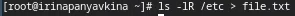{#fig:001 width=70%}

## Выполнение лабораторной работы
  Проверила, что в файл записались нужные значения с помощью утилиты head, она выводит первые 10 строк файла на экран (рис. 2).

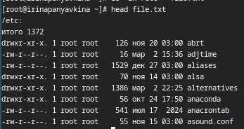{#fig:002 width=70%}

## Выполнение лабораторной работы
  Добавила в созданный файл имена файлов из домашнего каталога, используя перенаправление ">>" в режиме добавления (рис. 3).

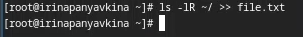{#fig:003 width=70%}

## Выполнение лабораторной работы
  Вывела на экран имена всех файлов, имеющих расширение ".conf" с помощью утилиты grep (рис. 4).

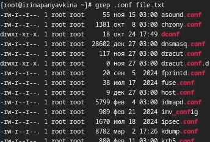{#fig:004 width=70%}

## Выполнение лабораторной работы
  Добавила вывод прошлой команды в новый файл conf.txt с помощью перенаправления ">" (файл создается при выполнении этой команды) (рис. 5).

{#fig:005 width=70%}

## Выполнение лабораторной работы
  Определяю,какие файлы в домашнем каталоге начинаютя с символа "c" с помощью утилиты find,
  прописываю ей в аргументах домашнюю директорию (тогда вывод относительно корневого каталога, а не домашнего будет),
  выбираю опцию -name (ищем по имени), и пишу маску, по которой будем искать имя, где * - любое кол-во любых символов,
  добавляю опцию -print, чтобы мне вывелся результат (рис. 6). Но таким образом я получаю информацию даже о файлах из подкаталогов домашнего каталога.

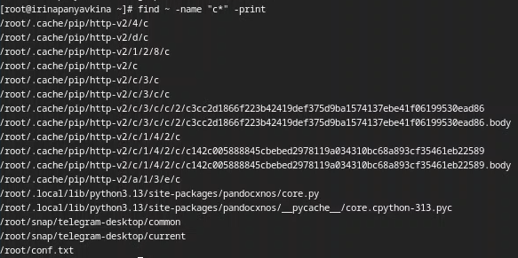{#fig:006 width=70%}

## Выполнение лабораторной работы
  Второй способ использовать утилиту ls -lR и использовать grep, чтобы найти элементы с первым символом c. 
  Однако этот способ не работает для поиска файлов из подкаталогов каталога (рис. 7).

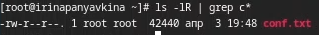{#fig:007 width=70%}

## Выполнение лабораторной работы
  С помощью метода find, чьи опции я расписала ранее, ищу все файлы, начинающиеся с буквы "h" (рис. 8).

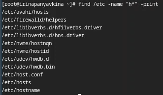{#fig:008 width=70%}

## Выполнение лабораторной работы
  Запускаю в фоновом режиме (на это указывает символ &) процесс, который будет записывать в файл logfile (с помощью перенаправления >) файлы, имена которых начинаются с log (рис. 9).

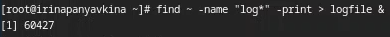{#fig:009 width=70%}

## Выполнение лабораторной работы
  Проверяю, что файл создан, удаляю его, проверяю, что файл удален (рис. 10).

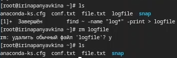{#fig:010 width=70%}

## Выполнение лабораторной работы
  Запускаю в консоли в фоновом режиме (с помощью символа &) редактор mousepad, потому что редактора gedit у меня, к сожалению нет, но работают они идентично (рис. 11).

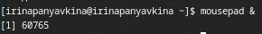{#fig:011 width=70%}
  
## Выполнение лабораторной работы
  С помощью утилиты ps определяю идентификатор процесса mousepad, его значение 60765 (рис. 12). Также мы можем определить идентификатор с помощью pgrep.

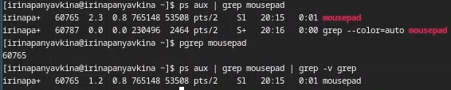{#fig:012 width=70%}

## Выполнение лабораторной работы
  Прочитала справку команды kill (рис. 13).

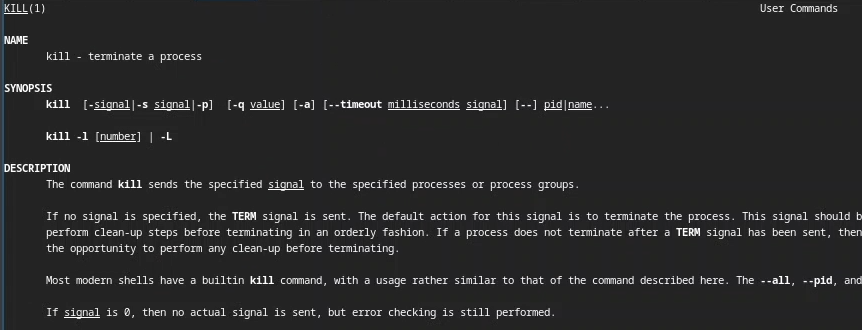{#fig:013 width=70%}

## Выполнение лабораторной работы
  Использую команду kill и идентификатор процесса, чтобы его удалить (рис. 14). Заметила, как у меня закрылась программа mousepad.

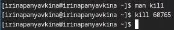{#fig:014 width=70%}

## Выполнение лабораторной работы
  Прочитала документацию про функции df и du (рис. 15).

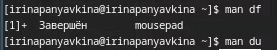{#fig:015 width=70%}

## Выполнение лабораторной работы
  Использую утилиту df опции -iv позволяют увидеть информацию об инодах и сделать вывод читаемым, игнорируя сообщения системы о нем (рис. 16). Эта утилита нам нужна, чтобы выяснить, сколько свободного места есть у нашей системы.

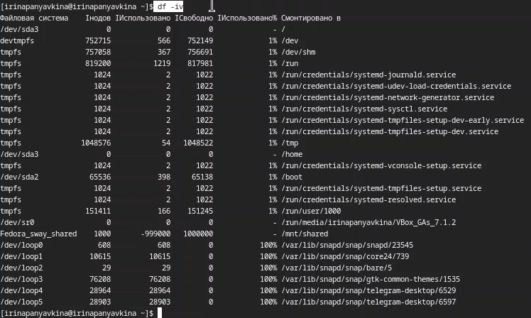{#fig:016 width=70%}

## Выполнение лабораторной работы
  Использую утилиту du. Она нужна чтобы просмотреть, сколько места занимают файлы в определенной директории и найти самые большие из них (рис. 17).
  Утилита -а позволит увидеть размер всех файлов, а не только директорий.

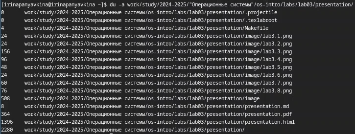{#fig:017 width=70%}

## Выполнение лабораторной работы
  Прочитала документацию о команде find (рис. 18).

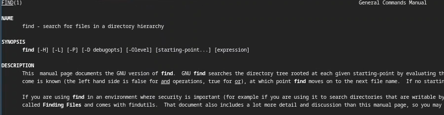{#fig:018 width=70%}

## Выполнение лабораторной работы
  Вывела имена всех директорий, имеющихся в моем домашнем каталоге, используя аргумент d у утилиты find опции -type, то есть указываю тип файлов, который мне нужен и этот тип Директория (рис. 19). 

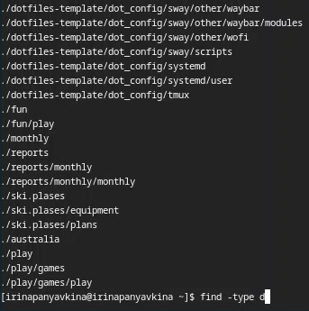{#fig:019 width=70%}

# Выводы

В результате данной лабораторной работы я ознакомилась с инструментами поиска файлов и фильтрации текстовых данных, а также приобрела практические навыки по управлению процессами (и заданиями), по проверке использования диска и по обслуживанию файловых систем.

# Список литературы

1. Лабораторная работа №8 [Электронный ресурс] URL: https://esystem.rudn.ru/mod/resource/view.php?id=1224383

