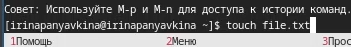

---
## Front matter
lang: ru-RU
title: Лабораторная работа №9
subtitle: Операционные системы
author:
  - Панявкина И.В.
institute:
  - Российский университет дружбы народов, Москва, Россия
date: 11 апреля 2025

## i18n babel
babel-lang: russian
babel-otherlangs: english

## Formatting pdf
toc: false
toc-title: Содержание
slide_level: 2
aspectratio: 169
section-titles: true
theme: metropolis
header-includes:
 - \metroset{progressbar=frametitle,sectionpage=progressbar,numbering=fraction}
---

## Цель работы

Цель данной лабораторной работы - освоение основных возможностей командной оболочки Midnight Commander, приобретение навыков практической работы по просмотру каталогов и файлов; манипуляций с ними

# Задание

## Задание по mc
1. Изучите информацию о mc, вызвав в командной строке man mc.
2. Запустите из командной строки mc, изучите его структуру и меню.
3. Выполните несколько операций в mc, используя управляющие клавиши (операции с панелями; выделение/отмена выделения файлов, копирование/перемещение файлов, получение информации о размере и правах доступа на файлы и/или каталоги
и т.п.)

## Задание по mc
4. Выполните основные команды меню левой (или правой) панели. Оцените степень
подробности вывода информации о файлах.
5. Используя возможности подменю Файл , выполните:
  - просмотр содержимого текстового файла;
  - редактирование содержимого текстового файла (без сохранения результатов
  редактирования);
  - создание каталога;
  - копирование в файлов в созданный каталог.

## Задание по mc
6. С помощью соответствующих средств подменю Команда осуществите:
  - поиск в файловой системе файла с заданными условиями (например, файла
  с расширением .c или .cpp, содержащего строку main);
  - выбор и повторение одной из предыдущих команд;
  - переход в домашний каталог;
  - анализ файла меню и файла расширений.
7. Вызовите подменю Настройки . Освойте операции, определяющие структуру экрана mc
(Full screen, Double Width, Show Hidden Files и т.д.)

## Задание по встроенному редактору mc

1. Создайте текстовой файл text.txt.
2. Откройте этот файл с помощью встроенного в mc редактора.
3. Вставьте в открытый файл небольшой фрагмент текста, скопированный из любого
другого файла или Интернета.

## Задание по встроенному редактору mc
4. Проделайте с текстом следующие манипуляции, используя горячие клавиши:
  - Удалите строку текста.
  - Выделите фрагмент текста и скопируйте его на новую строку
  - Выделите фрагмент текста и перенесите его на новую строку.
  - Сохраните файл.
  - Отмените последнее действие.
  - Перейдите в конец файла (нажав комбинацию клавиш) и напишите некоторый
  текст.
  - Перейдите в начало файла (нажав комбинацию клавиш) и напишите некоторый
  текст.
  4.8. Сохраните и закройте файл.
  
## Задание по встроенному редактору mc
5. Откройте файл с исходным текстом на некотором языке программирования (напри-
мер C или Java)
6. Используя меню редактора, включите подсветку синтаксиса, если она не включена,
или выключите, если она включена

## Теоретическое введение

  Командная оболочка — интерфейс взаимодействия пользователя с операционной системой и программным обеспечением посредством команд. Midnight Commander (или mc) — псевдографическая командная оболочка для UNIX/Linux систем. Для запуска mc необходимо в командной строке набрать mc и нажать Enter .
  MC имеет много полезных как для пользователей, так и для администраторов, функций (копирование, удаление, переименование/перемещение, создание директорий).

## Теоретическое введение
  Главное окно программы Midnight Commander состоит из трех полей. Два поля, называемые "панелями", идентичны по структуре и обычно отображают перечни файлов и подкаталогов каких-то двух каталогов файловой структуры. Эти каталоги в общем случае различны, хотя, в частности, могут и совпасть. Каждая панель состоит из заголовка, списка файлов и информационной строки.

  
## Теоретическое введение
  Третье поле экрана, расположенное в нижней части экрана, содержит командную строку текущей оболочки. В этом же поле (самая нижняя строка экрана) содержится подсказка по использованию функциональных клавиш F1 - F10. Самая верхняя строка экрана содержит строку горизонтального меню. Эта строка может не отображаться на экране; в этом случае доступ к ней можно получить, щёлкнув мышью по верхней рамке или нажав клавишу F9.

## Выполнение лабораторной работы

  С помощью команды man mc прочитала документацию про командную оболочку (рис. 1).

{#fig:001 width=70%}

## Выполнение лабораторной работы
  Ввожу в терминале mc и получаю окно, в котором далее смогу работать (рис. 2).

{#fig:002 width=70%}

## Выполнение лабораторной работы
  С помощью стрелочек влево/вправо могу перемещаться по директориям, вверх/вниз - перебирать файлы в выбранной директории. (рис. 3).

{#fig:003 width=70%}

## Выполнение лабораторной работы
  С помощью F5 могу создать копию файла в выбранном каталоге (рис. 4).

{#fig:004 width=70%}

## Выполнение лабораторной работы
  С помощью управляющих клавиш так же можно получить информациб о правах доступа на файл и информацию о нем (рис. 5).

{#fig:005 width=70%}

## Выполнение лабораторной работы
  В меню правой панели вывела информацию о файле, получаю информации больше чем в выводе ls -l  (рис. 6).

{#fig:006 width=70%}

## Выполнение лабораторной работы
  Через подменю "Файл" я просмотрела содержимое текстового файла  (рис. 7).

{#fig:007 width=70%}

## Выполнение лабораторной работы
  Открыла файл на изменение, поменяла пару строк и закрыла файл без сохранения (рис. 8).

{#fig:008 width=70%}

## Выполнение лабораторной работы
  Создала новый каталог (рис. 9).

{#fig:009 width=70%}

## Выполнение лабораторной работы
  Копирую файл в созданный каталог  (рис. 10).
  Действия выше можно было сделать с помощью горячих клавиш.

{#fig:010 width=70%}

## Выполнение лабораторной работы
  С помощью средств подменю Команда можно найти файл с заданным условием, я искала файлы формата .txt  (рис. 11).

{#fig:011 width=70%}

## Выполнение лабораторной работы
  Можно перемещаться между директориями, я перемещусь в домашнюю (рис. 12).

{#fig:012 width=70%}

## Выполнение лабораторной работы
  Можно использовать историю команд и применить команду из истории, я применила копирование файла (рис. 13).

{#fig:013 width=70%}

## Выполнение лабораторной работы
  Анализирую файл расширения (рис. 14).

{#fig:014 width=70%}

## Выполнение лабораторной работы
  Анализирую файл меню (рис. 15).

{#fig:015 width=70%}

## Выполнение лабораторной работы
  Из подменю настройки вызвала: 
  - окна настройки панели  (рис. 16), 
  - настройки внешнего вида  (рис. 17), 
  - настройки распознавания клавиш  (рис. 18), 
  - параметры конфигурации  (рис. 19).

## Выполнение лабораторной работы
{#fig:016 width=70%}

## Выполнение лабораторной работы
{#fig:017 width=70%}

## Выполнение лабораторной работы
{#fig:018 width=70%}

## Выполнение лабораторной работы
{#fig:019 width=70%}

## Выполнение лабораторной работы
  Командой touch text.txt создала файл (рис. 20).

{#fig:020 width=70%}

## Выполнение лабораторной работы
  Клавишей F4 открыла файл для записи, добавила в него текст (рис. 21).

{#fig:021 width=70%}

## Выполнение лабораторной работы
  Выделяю текст с помощью клавиши F3 и кликов мышью  (рис. 22).

{#fig:022 width=70%}

## Выполнение лабораторной работы
  Перемещаю выделенный текст с помощью клавиши F6 (рис. 23).

{#fig:023 width=70%}

## Выполнение лабораторной работы
  Удалила строку текста с помощью ctrl+y  (рис. 24).

{#fig:024 width=70%}

## Выполнение лабораторной работы
  Сохраняю изменения в файле с помощью горячей клавиши F2  (рис. 25).

{#fig:025 width=70%}

## Выполнение лабораторной работы
  С помощью ctrl+u отменяю поседнее действие и возвращаю удаленную строку  (рис. 26).

{#fig:026 width=70%}

## Выполнение лабораторной работы
  С помощью клавиш pgup pgdn у меня получилось попасть в начало и в конец файла соответственно, я добавила текст в начало и в конец файла  (рис. 27).

{#fig:027 width=70%}

## Выполнение лабораторной работы
  Горячая клавиша F10 закрывает файл, дополнительно спрашивая сохранить ли в нем несохраненные изменения, сохраняю и закрываю (рис. 28).

{#fig:028 width=70%}

## Выполнение лабораторной работы
  Открываю файл формата .cpp, с кодом на С++, встроенный редактор mc вывел его содержимое с подсветкой (рис. 29).

{#fig:029 width=70%}

## Выполнение лабораторной работы
  Я отключила подсветку и вывела снова тот же самый файл, но уже без подсветки (рис. 30).

{#fig:030 width=70%}

# Выводы

При выполнениии данной лабораторной работы я освоила основные возможности командной оболочки Midnight Commander, приобрела навыки практической работы по просмотру каталогов и файлов; манипуляций с ними

# Список литературы

1. Лабораторная работа №9 [Электронный ресурс] URL: https://esystem.rudn.ru/mod/resource/view.php?id=1224385

