---
## Front matter
lang: ru-RU
title: Лабораторная работа №10
subtitle: Операционные системы
author:
  - Панявкина И.В.
institute:
  - Российский университет дружбы народов, Москва, Россия
date: 17 апреля 2025

## i18n babel
babel-lang: russian
babel-otherlangs: english

## Formatting pdf
toc: false
toc-title: Содержание
slide_level: 2
aspectratio: 169
section-titles: true
theme: metropolis
header-includes:
 - \metroset{progressbar=frametitle,sectionpage=progressbar,numbering=fraction}
---

## Цель работы

Цель данной лабораторной работы - познакомиться с операционной системой Linux, получить практические навыки работы с редактором vi, установленным по умолчанию практически во всех дистрибутивах.

## Задание

1. Ознакомиться с теоретическим материалом.
2. Ознакомиться с редактором vi.
3. Выполнить упражнения, используя команды vi.

## Теоретическое введение
В большинстве дистрибутивов Linux в качестве текстового редактора по умолчанию устанавливается интерактивный экранный редактор vi (Visual display editor). Редактор vi имеет три режима работы:
  - командный режим — предназначен для ввода команд редактирования и навигации по редактируемому файлу;
  - режим вставки — предназначен для ввода содержания редактируемого файла;
  - режим последней (или командной) строки — используется для записи изменений в файл и выхода из редактора.
  - Для вызова редактора vi необходимо указать команду vi и имя редактируемого файла: vi <имя_файла> При этом в случае отсутствия файла с указанным именем будет создан такой файл.
  
## Теоретическое введение
  - Переход в командный режим осуществляется нажатием клавиши Esc.
  - Для выхода из редактора vi необходимо перейти в -режим последней строки: находясь в командном режиме, нажать Shift-; (по сути символ : — двоеточие), затем:
  - набрать символы wq, если перед выходом из редактора требуется записать изменения в файл;
  - набрать символ q (или q!), если требуется выйти из редактора без сохранения.

## Выполнение лабораторной работы
  Создаю директорию, в которой буду работать, с помощью команды mkdir, перехожу в нее с помощью команды cd, создаю и открываю для редактирования файл с помощью встроенного текстового редактора vi (рис. 1).

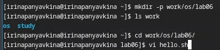{#fig:001 width=70%}

## Выполнение лабораторной работы
  Нажимаю i, чтобы начать редактирование и добавление текста (режим добавления), далее добавляю текст (рис. 2).

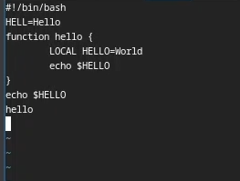{#fig:002 width=70%}

## Выполнение лабораторной работы
  Нажимаю esc, чтобы выйти из режима добавления и перейти в командный режим. Перехожу в режим последней строки (рис. 3).

## Выполнение лабораторной работы
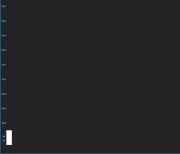{#fig:003 width=70%}

## Выполнение лабораторной работы
  Ввожу w для сохранения и q для выхода и нажимаю enter, после чего файл сохраняется с изменениями и я возвращаюсь в терминал (рис. 4).

## Выполнение лабораторной работы
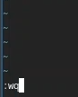{#fig:004 width=70%}

## Выполнение лабораторной работы
  С помощью chmod добавляю права на исполнение файла, делая его исполняемым (рис. 5).

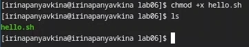{#fig:005 width=70%}

## Выполнение лабораторной работы
  Снова открываю этот файл с помощью текстового редактора vi (рис. 6).

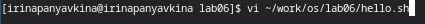{#fig:006 width=70%}

## Выполнение лабораторной работы
  Изменяю местоположение курсора (рис. 7).

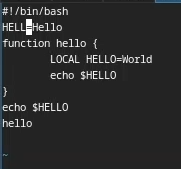{#fig:007 width=70%}

## Выполнение лабораторной работы
  В режиме добавления (клавиша i) удаляю слово LOCAL, снова перехожу в командный режим с помощью esc (рис. 8).

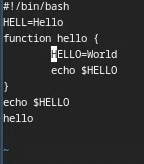{#fig:008 width=70%}

## Выполнение лабораторной работы
  В режиме добавления (клавиша i) добавляю слово local, снова перехожу в командный режим с помощью esc (рис. 9).

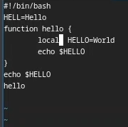{#fig:009 width=70%}

## Выполнение лабораторной работы
  В режиме добавления (клавиша i) перехожу в конец последней строки и добавляю новую строку, снова перехожу в командный режим с помощью esc. (рис. 10). После этого я вернулась в режим добавления, удалила строку и вернулась в командный режим.

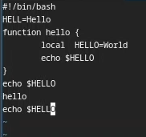{#fig:010 width=70%}

## Выполнение лабораторной работы
  В командном режиме я нажала "u" и отменила последнее действие, удаление строки (рис. 11).

## Выполнение лабораторной работы
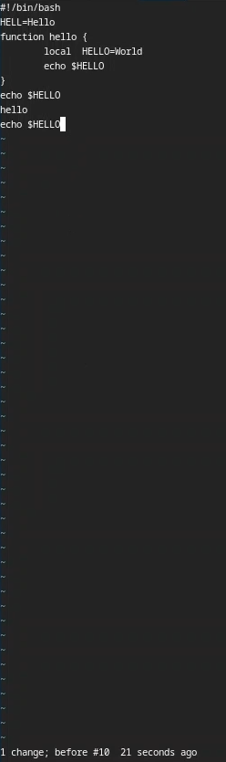{#fig:011 width=70%}

## Выполнение лабораторной работы
  Перешла в режим последней строки и ввела w для сохранения файла и q для выхода, нажала enter и файл закрылся (рис. 12]).

## Выполнение лабораторной работы
{#fig:012 width=70%}

# Выводы

При выполнении данной лабораторной работы я познакомилась с операционной системой Linux, получила практические навыки работы с редактором vi, установленным по умолчанию практически во всех дистрибутивах.

# Список литературы

1. Лабораторная работа №10 [Электронный ресурс] URL: https://esystem.rudn.ru/mod/workshop/view.php?id=1224388

