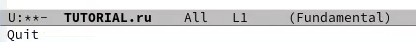

---
## Front matter
lang: ru-RU
title: Лабортная работа №11
subtitle: Операционные системы
author:
  - Панявкина И.В.
institute:
  - Российский университет дружбы народов, Москва, Россия
date: 25 апреля 2025

## i18n babel
babel-lang: russian
babel-otherlangs: english

## Formatting pdf
toc: false
toc-title: Содержание
slide_level: 2
aspectratio: 169
section-titles: true
theme: metropolis
header-includes:
 - \metroset{progressbar=frametitle,sectionpage=progressbar,numbering=fraction}
---

## Цель работы

  Цель данной лабораторной работы - познакомиться с операционной системой Linux. Получить практические навыки работы с редактором Emacs.

## Задание

1. Ознакомиться с теоретическим материалом.
2. Ознакомиться с редактором emacs.
3. Выполнить упражнения.
4. Ответить на контрольные вопросы

## Теоретическое введение
  Emacs — один из наиболее мощных и широко распространённых редакторов, используемых в мире UNIX. По популярности он соперничает с редактором vi и его клонами. В зависимости от ситуации, Emacs может быть:

- текстовым редактором;
- программой для чтения почты и новостей Usenet;
- интегрированной средой разработки (IDE);
- операционной системой;

## Теоретическое введение
  Всё это разнообразие достигается благодаря архитектуре Emacs, которая позволяет расширять возможности редактора при помощи языка Emacs Lisp. На языке C написаны лишь самые базовые и низкоуровневые части Emacs, включая полнофункциональный интерпретатор языка Lisp. Таким образом, Emacs имеет встроенный язык программирования, который может использоваться для настройки, расширения и изменения поведения редактора. В действительности, большая часть того редактора, с которым пользователи Emacs работают в наши дни, написана на языке Lisp.

## Теоретическое введение
  Первая версия редактора Emacs была написана в 70-х годах 20-го столетия Richard Stallman (Ричардом Столманом) как набор макросов для редактора TECO . В дальнейшем, уже будучи основателем Фонда Свободного программного обеспечения Free Software Foundation и проекта GNU, Stallman разработал GNU Emacs в развитие оригинального Emacs и до сих пор сопровождает эту программу. Emacs является одним из старейших редакторов. Он использовался тысячами программистов на протяжении последних 20 с лишним лет, для него создано много дополнительных пакетов расширений. Эти дополнения позволяют делать с помощью Emacs такие вещи, которые Stallman , вероятно, даже не считал возможными в начале своей работы над редактором.

## Выполнение лабораторной работы
  Открываю Emacs через терминал (рис. 1).

## Выполнение лабораторной работы
{#fig:001 width=70%}

## Выполнение лабораторной работы
  Создаю файл ab07.sh с помощью комбинации Ctrl-x Ctrl-f (рис. 2).

{#fig:002 width=70%}

## Выполнение лабораторной работы
  Прописываю в файле текст программы (рис. 3).

{#fig:003 width=70%}

## Выполнение лабораторной работы
  Сохраняю файл с помощью комбинации C-x C-s (рис. 4).

{#fig:004 width=70%}

## Выполнение лабораторной работы
  Вырезаю одной командой целую строку (С-k) (рис. 5).

{#fig:005 width=70%}

## Выполнение лабораторной работы
  Вставляю эту строку в конец файла (C-y) (рис. 6).

{#fig:006 width=70%}

## Выполнение лабораторной работы
  Выделяю область текста (C-space), копирую область в буфер обмена (M-w), вырезаю эту область с помощью C-w (рис. 7).

{#fig:007 width=70%}

## Выполнение лабораторной работы
  Вставляю область в конец файла (С-у)(рис. 8).

{#fig:008 width=70%}

## Выполнение лабораторной работы
  Отменяю последнее действие С-/ (рис. 9).

{#fig:009 width=70%}

## Выполнение лабораторной работы
  Перевожу курсор в начало строки С-а (рис. 10).

{#fig:010 width=70%}

## Выполнение лабораторной работы
  Перемещаю курсор в конец строки С-е (рис. 11).

{#fig:011 width=70%}

## Выполнение лабораторной работы
  Перемещаю курсор в начало файла М-< (рис. 12).

{#fig:012 width=70%}

## Выполнение лабораторной работы
  Перемещаю курсор в конец файлаM->(рис. 13).

{#fig:013 width=70%}

## Выполнение лабораторной работы
  Открываю список активных буферов в другом окне C-x C-b (рис. 14).

{#fig:014 width=70%}

## Выполнение лабораторной работы
  Переключаюсь на другой буфер C-x o (рис. 15).

{#fig:015 width=70%}

## Выполнение лабораторной работы
  Закрываю окно другого буфера C-x 0 (рис. 16).

{#fig:016 width=70%}

## Выполнение лабораторной работы
  Открываю другой буфер без вывода их списка на экран с помощью C-x b (рис. 17).

{#fig:017 width=70%}

## Выполнение лабораторной работы
  Делю фрейм на 4 части: сначала на два окна по вертикали (C-x 3),
а затем каждое из этих окон на две части по горизонтали (C-x 2) (рис. 18).

## Выполнение лабораторной работы
{#fig:018 width=70%}

## Выполнение лабораторной работы
  В каждом из четырех созданных окон с помощью C-x b открыла разные буферы и (рис. 19).

## Выполнение лабораторной работы
{#fig:019 width=70%}

## Выполнение лабораторной работы
  Перехожу в режим поиска с помощью C-s, ищу слова в тексте, они подсвечиваются (рис. 20).

## Выполнение лабораторной работы
{#fig:020 width=70%}

## Выполнение лабораторной работы
  С помощью той же комбинации C-s я могу перемещаться по результатам поиска (рис. 21).

## Выполнение лабораторной работы
{#fig:021 width=70%}

## Выполнение лабораторной работы
  С помощью C-g выхожу из режима поиска, снимается выделение (рис. 22).

{#fig:022 width=70%}

## Выполнение лабораторной работы
  Перехожу в режим поиска и замены с помощью M-%, ввожу какое слово хочу заменить, затем ввожу на какое хочу заменить (рис. 23).

{#fig:023 width=70%}

## Выполнение лабораторной работы
  Видим, что слова были заменены успешно (рис. 24).

## Выполнение лабораторной работы
{#fig:024 width=70%}

## Выполнение лабораторной работы
  С помощью M+s перехожу в другой режим поиска. Он отличается от предыдущего тем, что выводит результат в отдельном окне от окна буфера (рис. 25).

## Выполнение лабораторной работы
{#fig:025 width=70%}

# Выводы

  В ходе данной лаборатрной работы я познакомилась с операционной системой Linuх, получила практические навыки работы с редактором Emacs.
  
# Список литературы

1. Лабораторная работа №11 [Электронный ресурс] URL: https://esystem.rudn.ru/mod/resource/view.php?id=1224389
