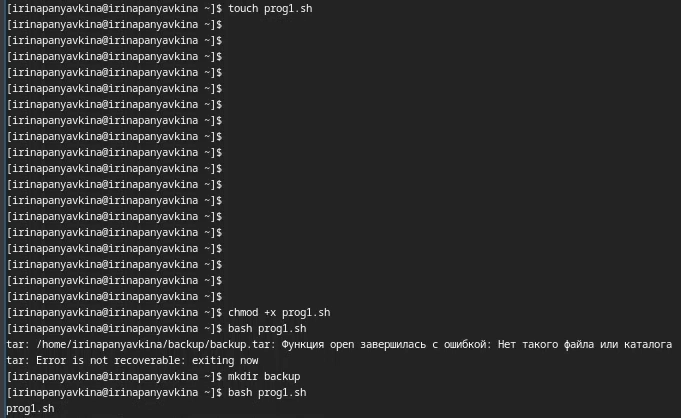

---
## Front matter
lang: ru-RU
title: Лабораторная работа №12
subtitle: Операционные системы
author:
  - Панявкина И.В.
institute:
  - Российский университет дружбы народов, Москва, Россия
date: 28 апреля 2025

## i18n babel
babel-lang: russian
babel-otherlangs: english

## Formatting pdf
toc: false
toc-title: Содержание
slide_level: 2
aspectratio: 169
section-titles: true
theme: metropolis
header-includes:
 - \metroset{progressbar=frametitle,sectionpage=progressbar,numbering=fraction}
---

## Цель работы
Цель данной лабораторной работы - изучить основы программирования в оболочке ОС UNIX/Linux, научиться писать небольшие командные файлы.

## Задание
1. Написать скрипт, который при запуске будет делать резервную копию самого себя (то
есть файла, в котором содержится его исходный код) в другую директорию backup
в вашем домашнем каталоге. При этом файл должен архивироваться одним из архиваторов на выбор zip, bzip2 или tar. Способ использования команд архивации
необходимо узнать, изучив справку.

## Задание
2. Написать пример командного файла, обрабатывающего любое произвольное число
аргументов командной строки, в том числе превышающее десять. Например, скрипт
может последовательно распечатывать значения всех переданных аргументов.

## Задание
3. Написать командный файл — аналог команды ls (без использования самой этой команды и команды dir). Требуется, чтобы он выдавал информацию о нужном каталоге
и выводил информацию о возможностях доступа к файлам этого каталога.

## Задание
4. Написать командный файл, который получает в качестве аргумента командной строки
формат файла (.txt, .doc, .jpg, .pdf и т.д.) и вычисляет количество таких файлов
в указанной директории. Путь к директории также передаётся в виде аргумента командной строки

## Теоретическое введение
Командный процессор (командная оболочка, интерпретатор команд shell) — это программа, позволяющая пользователю взаимодействовать с операционной системой компьютера. В операционных системах типа UNIX/Linux наиболее часто используются следующие реализации командных оболочек:

## Теоретическое введение
1. оболочка Борна (Bourne shell или sh) — стандартная командная оболочка UNIX/Linux, содержащая базовый, но при этом полный набор функций;
2. С-оболочка (или csh) — надстройка на оболочкой Борна, использующая С-подобный синтаксис команд с возможностью сохранения истории выполнения команд;
3. оболочка Корна (или ksh) — напоминает оболочку С, но операторы управления программой совместимы с операторами оболочки Борна;
4. BASH — сокращение от Bourne Again Shell (опять оболочка Борна), в основе своей совмещает свойства оболочек С и Корна (разработка компании Free Software Foundation).

## Теоретическое введение
POSIX (Portable Operating System Interface for Computer Environments) — набор стандартов описания интерфейсов взаимодействия операционной системы и прикладных программ. Стандарты POSIX разработаны комитетом IEEE (Institute of Electrical and Electronics Engineers) для обеспечения совместимости различных UNIX/Linux-подобных операционных систем и переносимости прикладных программ на уровне исходного кода. POSIX-совместимые оболочки разработаны на базе оболочки Корна. Рассмотрим основные элементы программирования в оболочке bash. В других оболочках большинство команд будет совпадать с описанными ниже.

## Выполнение лабораторной работы
Создаю файл prog1.sh в котором буду писать программу с расширением sh (shell) с помощью утилиты touch, далее делаю его исполняемым с помощью chmod +x, открываю файл в текстовом редакторе, пишу в нем код, и после того как я написала программу в файле, я могу его запустить bash <имя командного файла> <аргументы> (рис. 1).

## Выполнение лабораторной работы
{#fig:001 width=70%}

## Выполнение лабораторной работы
скрипт, который при запуске будет делать резервную копию самого себя (то
есть файла, в котором содержится его исходный код) в другую директорию backup
в моем домашнем каталоге. При этом файл должен архивироваться одним из архиваторов на выбор zip, bzip2 или tar (рис. 2).

## Выполнение лабораторной работы
{#fig:002 width=70%}

## Выполнение лабораторной работы
Создаю файл prog2.sh в котором буду пистаь программу с расширением sh (shell) с помощью утилиты touch, далее делаю его исполняемым с помощью chmod +x, открываю файл в текстовом редакторе, пишу в нем код, и после того как я написала программу в файле, я могу его запустить bash <имя командного файла> <аргументы> (рис. 3).

## Выполнение лабораторной работы
{#fig:003 width=70%}

## Выполнение лабораторной работы
Пример командного файла, обрабатывающего любое произвольное число
аргументов командной строки, в том числе превышающее десять. Например, скрипт
может последовательно распечатывать значения всех переданных аргументов (рис. 4).

## Выполнение лабораторной работы
{#fig:004 width=70%}

## Выполнение лабораторной работы
Создаю файл prog3.sh в котором буду пистаь программу с расширением sh (shell) с помощью утилиты touch, далее делаю его исполняемым с помощью chmod +x, открываю файл в текстовом редакторе, пишу в нем код, и после того как я написала программу в файле, я могу его запустить bash <имя командного файла> <аргументы> (рис. 5).

## Выполнение лабораторной работы
{#fig:005 width=70%}

## Выполнение лабораторной работы
Командный файл — аналог команды ls (без использования самой этой команды и команды dir). Требуется, чтобы он выдавал информацию о нужном каталоге
и выводил информацию о возможностях доступа к файлам этого каталога. (рис. 6).

## Выполнение лабораторной работы
{#fig:006 width=70%}

## Выполнение лабораторной работы
Создаю файл prog4.sh в котором буду пистать программу с расширением sh (shell) с помощью утилиты touch, далее делаю его исполняемым с помощью chmod +x, открываю файл в любом текстовом редакторе, пишу в нем код (рис. 7).

## Выполнение лабораторной работы
{#fig:007 width=70%}

## Выполнение лабораторной работы
Командный файл, который получает в качестве аргумента командной строки
формат файла (.txt, .doc, .jpg, .pdf и т.д.) и вычисляет количество таких файлов
в указанной директории. Путь к директории также передаётся в виде аргумента командной строки (рис. 8).

## Выполнение лабораторной работы
{#fig:008 width=70%}

## Выполнение лабораторной работы
И после того как я написала программу в файле, я могу его запустить bash <имя командного файла> <аргументы> (рис. 9).

## Выполнение лабораторной работы
{#fig:009 width=70%}

# Выводы

При выполнении данной лабораторной работы я изучила основы программирования в оболочке ОС UNIX/Linux, научилась писать небольшие командные файлы.

# Список литературы

1. Лабораторная работа №12 [Электронный ресурс] URL: https://esystem.rudn.ru/mod/resource/view.php?id=1224391
