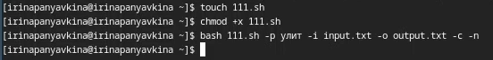
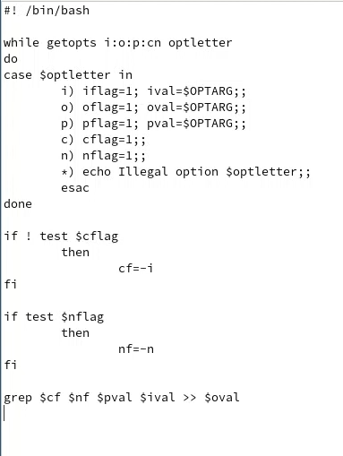
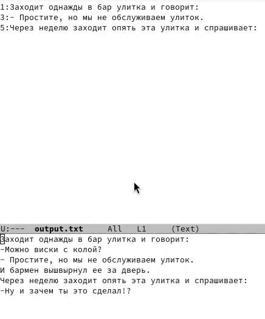
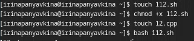
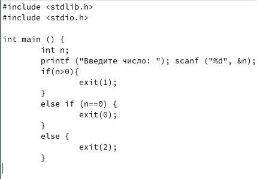
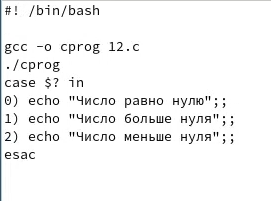
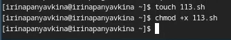
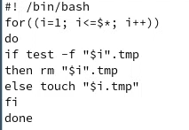
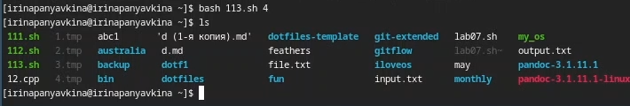
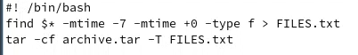

---
## Front matter
lang: ru-RU
title: Лабораторная работа №13
subtitle: Операционные системы
author:
  - Панявкина И.В.
institute:
  - Российский университет дружбы народов, Москва, Россия
date: 10 мая 2025

## i18n babel
babel-lang: russian
babel-otherlangs: english

## Formatting pdf
toc: false
toc-title: Содержание
slide_level: 2
aspectratio: 169
section-titles: true
theme: metropolis
header-includes:
 - \metroset{progressbar=frametitle,sectionpage=progressbar,numbering=fraction}
---

## Цель работы
Цель данной лабораторной работы - изучить основы программирования в оболочке ОС UNIX, научится писать более
сложные командные файлы с использованием логических управляющих конструкций и циклов.

## Задание
1. Используя команды getopts grep, написать командный файл, который анализирует
командную строку с ключами:
- -iinputfile — прочитать данные из указанного файла;
- -ooutputfile — вывести данные в указанный файл;
- -pшаблон — указать шаблон для поиска;
- -C — различать большие и малые буквы;
- -n — выдавать номера строк.
а затем ищет в указанном файле нужные строки, определяемые ключом -p.

## Задание
2. Написать на языке Си программу, которая вводит число и определяет, является ли оно
больше нуля, меньше нуля или равно нулю. Затем программа завершается с помощью
функции exit(n), передавая информацию в о коде завершения в оболочку. Команд-
ный файл должен вызывать эту программу и, проанализировав с помощью команды
$?, выдать сообщение о том, какое число было введено.

## Задание
3. Написать командный файл, создающий указанное число файлов, пронумерованных
последовательно от 1 до 𝑁 (например 1.tmp, 2.tmp, 3.tmp,4.tmp и т.д.). Число файлов,
которые необходимо создать, передаётся в аргументы командной строки. Этот же ко-
мандный файл должен уметь удалять все созданные им файлы (если они существуют).

## Задание
4. Написать командный файл, который с помощью команды tar запаковывает в архив
все файлы в указанной директории. Модифицировать его так, чтобы запаковывались
только те файлы, которые были изменены менее недели тому назад (использовать
команду find).

## Теоретическое введение
Командный процессор (командная оболочка, интерпретатор команд shell) — это программа, позволяющая пользователю взаимодействовать с операционной системой компьютера. В операционных системах типа UNIX/Linux наиболее часто используются следующие реализации командных оболочек:

## Теоретическое введение
оболочка Борна (Bourne shell или sh) — стандартная командная оболочка UNIX/Linux, содержащая базовый, но при этом полный набор функций;
С-оболочка (или csh) — надстройка на оболочкой Борна, использующая С-подобный синтаксис команд с возможностью сохранения истории выполнения команд;
оболочка Корна (или ksh) — напоминает оболочку С, но операторы управления программой совместимы с операторами оболочки Борна;
BASH — сокращение от Bourne Again Shell (опять оболочка Борна), в основе своей совмещает свойства оболочек С и Корна (разработка компании Free Software Foundation).

## Теоретическое введение
POSIX (Portable Operating System Interface for Computer Environments) — набор стандартов описания интерфейсов взаимодействия операционной системы и прикладных программ. Стандарты POSIX разработаны комитетом IEEE (Institute of Electrical and Electronics Engineers) для обеспечения совместимости различных UNIX/Linux-подобных операционных систем и переносимости прикладных программ на уровне исходного кода. POSIX-совместимые оболочки разработаны на базе оболочки Корна. Рассмотрим основные элементы программирования в оболочке bash. В других оболочках большинство команд будет совпадать с описанными ниже.

## Выполнение лабораторной работы
Создаю файл с разрешением на исполнение (рис. 1).

{#fig:001 width=70%}

## Выполнение лабораторной работы
Командный файл, c командами getopts и grep, который анализирует
командную строку с ключами:
- -iinputfile — прочитать данные из указанного файла;
- -ooutputfile — вывести данные в указанный файл;
- -pшаблон — указать шаблон для поиска;
- -C — различать большие и малые буквы;
- -n — выдавать номера строк.
а затем ищет в указанном файле нужные строки, определяемые ключом -p (рис. 2).

## Выполнение лабораторной работы
{#fig:002 width=70%}

## Выполнение лабораторной работы
Результат работы программы в файле output.txt (рис. 3).

{#fig:003 width=70%}

## Выполнение лабораторной работы
Создаю исполняемый файл для второй программы, также создаю файл 12.с для программы на Си (рис. 4).

{#fig:004 width=70%}

## Выполнение лабораторной работы
Пишу программу на языке Си, которая вводит число и определяет, является ли оно
больше нуля, меньше нуля или равно нулю. Затем программа завершается с помощью
функции exit(n), передавая информацию в о коде завершения в оболочку (рис. 5).

## Выполнение лабораторной работы
{#fig:005 width=70%}

## Выполнение лабораторной работы
Командный файл должен вызывать эту программу и, проанализировав с помощью команды
$?, выдать сообщение о том, какое число было введено (рис. 6).

## Выполнение лабораторной работы
{#fig:006 width=70%}

## Выполнение лабораторной работы
Программа работает корректно (рис. 7).

{#fig:007 width=70%}

## Выполнение лабораторной работы
Создаю исполняемый файл для третьей программы (рис. 8).

{#fig:008 width=70%}

## Выполнение лабораторной работы
Командный файл, создающий указанное число файлов, пронумерованных
последовательно от 1 до N (например 1.tmp, 2.tmp, 3.tmp,4.tmp и т.д.). Число файлов,
которые необходимо создать, передаётся в аргументы командной строки. Этот же командный файл должен уметь удалять все созданные им файлы (если они существуют) (рис. 9).

## Выполнение лабораторной работы
{#fig:009 width=70%}

## Выполнение лабораторной работы
Проверяю, что программа создала файлы и удалила их при соответствующих запросах (рис. 10).

{#fig:010 width=70%}

## Выполнение лабораторной работы
Создаю исполняемый файл для четвертой программы. Это командный файл, который с помощью команды tar запаковывает в архив
все файлы в указанной директории. Модифицировать его так, чтобы запаковывались
только те файлы, которые были изменены менее недели тому назад (использовать
команду find) (рис. 11).

## Выполнение лабораторной работы
{#fig:011 width=70%}

## Выполнение лабораторной работы
Проверяю работу программы (рис. 12).

{#fig:012 width=70%}

# Выводы

При выполнении данной лабораторной работы я изучила основы программирования в оболочке ОС UNIX, научилась писать более сложные командные файлы с использованием логических управляющих конструкций и циклов.

# Список литературы

1. Лабораторная работа №13 [Электронный ресурс] URL:https://esystem.rudn.ru/mod/resource/view.php?id=1224393
